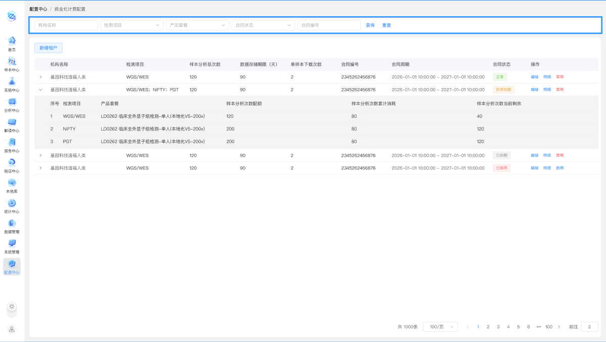
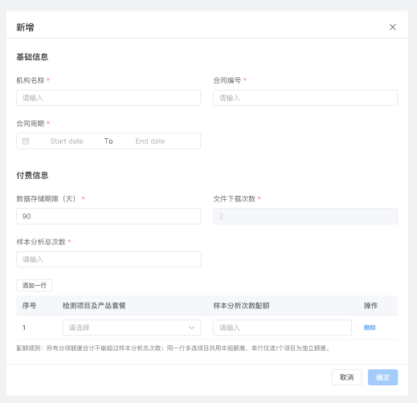
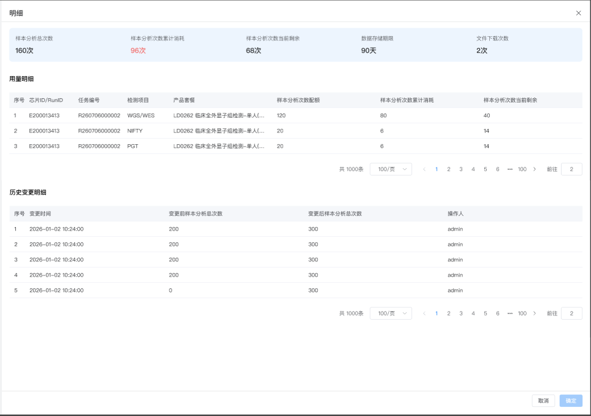

# V1.6.1 需求文档（配置中心-商业化计费配置）

## 1. 项目概述

### 1.1 项目背景

当前系统需要支撑商业化试点场景下的合同化计费与资源管控能力。对于医院租户，运营或销售人员需要根据已签订合同，为不同机构配置样本分析次数、数据存储期限、单样本下载次数等核心计费参数，并持续支撑新租户开户、合同续约、合同额度增补、启用/禁用、消耗查询与变更追溯。

本期聚焦配置中心中的“商业化计费配置”后台能力，目标是在不改变原有解读核心业务流程的前提下，形成一套可配置、可查看、可维护、可追溯的合同配额管理入口。

### 1.2 项目定位

“商业化计费配置”是配置中心下的一个新增页面，用于让具备 Administrator 后台配置权限的运营/销售人员按机构合同维护商业化计费参数，并查看合同维度与套餐维度的配额、消耗、剩余及历史变更信息。

模块定位：

- 菜单路径：配置中心 / 商业化计费配置
- 模块编码主线：`CONFIG / BILLCFG`
- 本期版本：`V1.6.1`

### 1.3 本期范围与不做事项

- 本期包含：
  - 商业化计费配置列表查询与默认加载
  - 合同维度列表展示与展开明细展示
  - 新增合同配置
  - 编辑合同配置
  - 明细抽屉查看配额、消耗与历史变更
  - 合同配置启用/禁用与状态展示
- 本期不做：
  - 租户侧自助购买、支付、对账能力
  - 批量勾选、批量启用/禁用、批量删除能力
  - 在明细抽屉中直接编辑配置
  - 手工直接录入“样本分析总次数”

---

## 2. 项目目标

| 目标编号 | 目标描述                                      | 衡量指标                                             | 优先级 |
| -------- | --------------------------------------------- | ---------------------------------------------------- | ------ |
| G01      | 提供机构合同级商业化计费配置后台入口          | 具备权限的用户可完成查询、新增、编辑、查看与启停     | P0     |
| G02      | 支撑检测项目/产品套餐维度的分析配额配置与查看 | 合同配额、套餐明细、消耗和剩余可在同一页面链路下查看 | P0     |
| G03      | 保证已发生消耗后的配置变更受控                | 已产生分析消耗的记录仅允许只读查看，不允许继续修改   | P0     |
| G04      | 保证合同配置状态可管理、变更可追溯            | 用户可查看状态、明细和历史变更记录，并执行启用/禁用  | P0     |

---

## 3. 角色与权限

### 3.1 角色清单

- 同全局基线。
- 本模块仅面向具备 Administrator 后台配置权限的运营/销售人员开放。

### 3.2 权限清单

- 同全局基线。
- 本模块至少需要支持以下业务动作权限：查询、查看、新增、编辑、明细查看、启用、禁用。

### 3.3 数据权限规则

- 同全局基线。
- 本模块查看与维护的数据范围，以当前用户有权操作的机构合同配置记录为准。

---

## 4. 主业务流程

### 4.1 主流程 F01：合同配置新增与后续维护

1. 具备权限的运营/销售人员进入“配置中心 / 商业化计费配置”页面。
2. 用户通过查询区定位目标机构或合同，或点击“新增租户”进入新增弹窗。
3. 用户填写机构基础信息、合同信息、付费信息及检测项目配额后提交，生成一条合同配置记录。
4. 页面列表按合同维度展示主记录，并支持展开查看检测项目/产品套餐维度的明细配额与消耗。
5. 用户可按记录状态执行查看明细、编辑、启用或禁用。
6. 若记录尚未产生分析消耗，则允许编辑；若已产生分析消耗，则仅允许只读查看当前配置。
7. 用户可在明细抽屉中查看当前合同的汇总配额、用量明细和历史变更记录。

### 4.2 页面原型/布局示意

#### 列表页原型

#### 新增 / 编辑弹窗原型

#### 明细抽屉原型

---

## 5. 功能清单

| 功能点编号                      | 菜单名   | 一级页面       | 二级页面/区域       | 功能名称               | 功能描述                                                                                 | 需求类型 | 引入版本 | 最近变更版本 | 当前状态 | 优先级 | 关联验收编号 |
| ------------------------------- | -------- | -------------- | ------------------- | ---------------------- | ---------------------------------------------------------------------------------------- | -------- | -------- | ------------ | -------- | ------ | ------------ |
| `REQ-CONFIG-BILLCFG-LIST-001`   | 配置中心 | 商业化计费配置 | 查询区 / 列表页     | 列表查询与默认加载     | 按机构、检测项目、产品套餐、合同状态、合同编号查询合同配置记录，并支持默认加载与空态展示 | 新增     | V1.6.1   | V1.6.1       | 已确认   | P0     | [A01]        |
| `REQ-CONFIG-BILLCFG-LIST-002`   | 配置中心 | 商业化计费配置 | 主列表 / 展开明细区 | 合同列表展示与展开明细 | 以合同维度展示主记录，并支持展开查看检测项目/产品套餐维度的配额、消耗与剩余明细          | 新增     | V1.6.1   | V1.6.1       | 已确认   | P0     | [A02]        |
| `REQ-CONFIG-BILLCFG-LIST-003`   | 配置中心 | 商业化计费配置 | 操作列 / 状态列     | 合同状态展示与启停控制 | 根据启停与有效期展示合同状态，并支持启用/禁用控制                                        | 新增     | V1.6.1   | V1.6.1       | 已确认   | P0     | [A03]        |
| `REQ-CONFIG-BILLCFG-FORM-001`   | 配置中心 | 商业化计费配置 | 新增弹窗            | 新增合同配置           | 录入机构、合同、基础付费参数及检测项目配额，创建一条新的合同配置记录                     | 新增     | V1.6.1   | V1.6.1       | 已确认   | P0     | [A04]        |
| `REQ-CONFIG-BILLCFG-FORM-002`   | 配置中心 | 商业化计费配置 | 编辑弹窗            | 编辑合同配置           | 在未产生分析消耗时允许修改合同配置，在已产生分析消耗时退化为只读查看态                   | 新增     | V1.6.1   | V1.6.1       | 已确认   | P0     | [A05]        |
| `REQ-CONFIG-BILLCFG-DETAIL-001` | 配置中心 | 商业化计费配置 | 明细抽屉            | 明细抽屉查看           | 查看合同汇总配额、样本/Run 维度用量明细及历史变更记录                                    | 新增     | V1.6.1   | V1.6.1       | 已确认   | P0     | [A06]        |

---

## 6. 模块详细需求

### 6.1 模块：配置中心 / 商业化计费配置

#### REQ-CONFIG-BILLCFG-LIST-001 列表查询与默认加载

| 字段         | 内容                          |
| ------------ | ----------------------------- |
| 功能点编号   | `REQ-CONFIG-BILLCFG-LIST-001` |
| 需求类型     | 新增                          |
| 引入版本     | `V1.6.1`                      |
| 最近变更版本 | `V1.6.1`                      |
| 当前状态     | 已确认                        |
| 关联验收编号 | `[A01]`                       |

##### 功能说明

页面用于展示各机构合同下的商业化计费配置记录，并提供按条件查询与定位目标合同的能力。

##### 页面展示说明

> 原型对应：见 4.2「列表页原型」。

查询区字段：

| 字段     | 控件/形式 | 约束/说明              |
| -------- | --------- | ---------------------- |
| 机构名称 | 下拉多选  | 支持按机构名称筛选     |
| 检测项目 | 下拉多选  | 支持按检测项目筛选     |
| 产品套餐 | 下拉多选  | 支持按产品套餐筛选     |
| 合同状态 | 下拉单选  | 支持按合同状态筛选     |
| 合同编号 | 输入框    | 支持按合同编号模糊查询 |

查询区操作：

| 操作     | 说明                                   |
| -------- | -------------------------------------- |
| 查询     | 按当前筛选条件刷新列表结果             |
| 重置     | 清空当前查询条件，恢复页面默认列表结果 |
| 新增租户 | 点击后打开新增弹窗                     |

##### 交互逻辑

- 页面首次进入时，按系统默认查询条件加载第一页数据。
- 点击“查询”后，仅刷新列表区与分页数据，不重置查询条件。
- 点击“重置”后，清空当前查询条件并恢复默认列表结果。
- 点击“新增租户”后，打开新增弹窗。
- 查询结果为空时，保留当前筛选条件并展示空结果状态。

##### 异常场景 / 边界说明

- 本期不包含批量筛选后的批量操作。
- 列表无数据时展示空列表状态，提示文案为“暂无数据”；查询命中为空时展示无结果状态。

#### REQ-CONFIG-BILLCFG-LIST-002 合同列表展示与展开明细

| 字段         | 内容                          |
| ------------ | ----------------------------- |
| 功能点编号   | `REQ-CONFIG-BILLCFG-LIST-002` |
| 需求类型     | 新增                          |
| 引入版本     | `V1.6.1`                      |
| 最近变更版本 | `V1.6.1`                      |
| 当前状态     | 已确认                        |
| 关联验收编号 | `[A02]`                       |

##### 功能说明

页面主列表中的一行记录代表“某机构下的一条合同配置记录”，用于展示合同层级的汇总配额信息；展开区用于展示当前合同下检测项目/产品套餐维度的明细配额、累计消耗和当前剩余。

##### 页面展示说明

> 原型对应：见 4.2「列表页原型」。

主列表核心字段：

| 字段               | 说明                                       |
| ------------------ | ------------------------------------------ |
| 机构名称           | 展示当前合同所属机构                       |
| 检测项目           | 展示当前合同绑定的检测项目合集             |
| 样本分析总次数     | 展示当前合同下可用的样本分析总配额         |
| 数据存储期限（天） | 展示该合同配置的数据默认留存时长           |
| 单样本下载次数     | 展示单个样本允许下载的次数上限             |
| 合同编号           | 展示当前合同唯一编号                       |
| 合同周期           | 展示合同生效时间与到期时间                 |
| 合同状态           | 根据启停状态与合同剩余有效期动态计算并展示 |
| 操作               | 提供编辑、明细、启用/禁用入口              |

展开明细区字段：

| 字段                 | 说明                                |
| -------------------- | ----------------------------------- |
| 序号                 | 展示当前明细行序号                  |
| 检测项目             | 展示当前明细所属检测项目            |
| 产品套餐             | 展示当前检测项目对应的具体套餐名称  |
| 样本分析次数配额     | 展示该检测项目/套餐下分配的分析次数 |
| 样本分析次数累计消耗 | 展示该检测项目/套餐已累计消耗的次数 |
| 样本分析次数当前剩余 | 展示当前剩余可用次数                |

##### 业务规则

- 主表“检测项目”字段展示当前合同下展开子表中“检测项目”的去重合集，并以分号分隔展示。
- 主表负责展示合同维度的汇总视图；展开区负责展示检测项目/产品套餐维度的拆分视图。
- 展开明细区仅展示当前主记录所属合同的数据，不跨合同混合。

##### 交互逻辑

- 每条主记录支持展开/收起。
- 页面初始状态下，所有主记录默认收起。
- 点击展开按钮后，仅展示当前合同对应的明细数据；再次点击可收起。

##### 异常场景 / 边界说明

- 主表以合同汇总信息为主，套餐级配额与消耗以下方展开明细区为准。
- 本期不包含独立的套餐级批量维护入口。

#### REQ-CONFIG-BILLCFG-LIST-003 合同状态展示与启停控制

| 字段         | 内容                          |
| ------------ | ----------------------------- |
| 功能点编号   | `REQ-CONFIG-BILLCFG-LIST-003` |
| 需求类型     | 新增                          |
| 引入版本     | `V1.6.1`                      |
| 最近变更版本 | `V1.6.1`                      |
| 当前状态     | 已确认                        |
| 关联验收编号 | `[A03]`                       |

##### 功能说明

系统需要基于合同启停状态与有效期动态展示合同状态，并支持对单条合同配置执行启用或禁用控制。

##### 业务规则

状态枚举为：正常、即将到期、已到期、已停用。

状态判定逻辑：

- 启用 + 剩余到期时间大于 30 天：显示“正常”
- 启用 + 剩余到期时间小于等于 30 天：显示“即将到期”
- 启用 + 已过到期日：显示“已到期”
- 停用：无论合同是否到期，统一显示“已停用”

状态展示颜色：

- 正常：绿色
- 即将到期：橙色
- 已到期：灰色
- 已停用：红色

优先级规则：

- 停用状态优先级高于合同到期状态。

##### 交互逻辑

- 操作列中“启用”和“禁用”互斥展示。
- 点击禁用前，必须弹出二次确认，提示语为“确认禁用？”。
- 点击启用前，必须弹出二次确认，提示语为“确认启用？”。
- 禁用后，冻结该合同配置下所有样本提交与配额消耗能力。
- 启用后，恢复该合同配置对应的检测提交与配额消耗能力。

##### 异常场景 / 边界说明

- 禁用后，已有记录仍可查看。
- 禁用记录仍允许查看明细抽屉与进入编辑弹窗查看当前配置。

#### REQ-CONFIG-BILLCFG-FORM-001 新增合同配置

| 字段         | 内容                          |
| ------------ | ----------------------------- |
| 功能点编号   | `REQ-CONFIG-BILLCFG-FORM-001` |
| 需求类型     | 新增                          |
| 引入版本     | `V1.6.1`                      |
| 最近变更版本 | `V1.6.1`                      |
| 当前状态     | 已确认                        |
| 关联验收编号 | `[A04]`                       |

##### 功能说明

新增弹窗用于在当前页面内新增一条机构合同配置记录，完成机构基础信息、合同信息、基础付费参数及检测项目配额的录入。

##### 页面展示说明

> 原型对应：见 4.2「新增 / 编辑弹窗原型」。

弹窗结构分为两部分：

- 基础信息
- 付费信息

底部操作区包含：

- 取消
- 确定

基础信息字段：

| 字段     | 控件/形式      | 必填 | 约束/说明                                   |
| -------- | -------------- | ---- | ------------------------------------------- |
| 机构名称 | 下拉选择器     | 是   | 通过下拉选择机构                            |
| 合同编号 | 输入框         | 是   | 仅支持字母、数字、-、\_，最大长度 50 个字符 |
| 合同周期 | 日期范围选择器 | 是   | 按开始时间与结束时间成对维护                |

付费信息字段：

| 字段               | 控件/形式        | 必填               | 约束/说明                                                                    |
| ------------------ | ---------------- | ------------------ | ---------------------------------------------------------------------------- |
| 数据存储期限（天） | 输入框           | 是                 | 默认值 90，仅支持整数                                                        |
| 文件下载次数       | 输入框（只读）   | 否                 | 默认值 2，仅支持整数，默认置灰不可编辑                                       |
| 样本分析总次数     | 展示字段（只读） | 是（系统自动生成） | 默认置灰不可编辑，由下方“检测项目配额区”的配额自动汇总生成，用户不可手工填写 |

检测项目配额区：

| 项目     | 约束/说明                                                |
| -------- | -------------------------------------------------------- |
| 默认行数 | 默认展示 1 行配置数据                                    |
| 删除按钮 | 仅剩 1 行时，“删除”按钮置灰不可点击                      |
| 新增行   | 支持点击“添加一行”新增配额行                             |
| 行内字段 | 每行包含：检测项目及产品套餐、样本分析次数配额、删除操作 |

##### 业务规则

- 检测项目及产品套餐使用级联选择器：第一层为检测项目，可多选；第二层为对应检测项目下的产品套餐，可多选。
- 每一行的检测项目及产品套餐为必填。
- 每一行的样本分析次数配额为必填，且仅支持整数。
- **已确认规则**：样本分析总次数 = 检测项目配额区各行“样本分析次数配额”的自动汇总结果。
- 同一行内多选的检测项目/产品套餐共享该行配额，不重复累计到总次数。
- 用户不能手工直接修改样本分析总次数。

##### 交互逻辑

- 点击“取消”后关闭弹窗，不保存当前录入内容。
- 点击“确定”后，执行表单校验与配额区校验；校验通过后提交新增配置，提交成功后关闭弹窗并提示“新增成功”；校验失败时终止提交并保持弹窗内容。

##### 校验规则

- 机构名称、合同编号、合同周期、数据存储期限、每行检测项目及产品套餐、每行样本分析次数配额均为必填。
- 合同编号仅支持字母、数字、-、\_，最大长度 50 个字符。
- 数据存储期限、文件下载次数、样本分析次数配额均仅允许整数。

##### 异常场景 / 边界说明

- 文件下载次数在本期为固定默认值展示，不支持用户修改。
- 新增弹窗为页面内弹窗交互，不跳转至新页面。

#### REQ-CONFIG-BILLCFG-FORM-002 编辑合同配置

| 字段         | 内容                          |
| ------------ | ----------------------------- |
| 功能点编号   | `REQ-CONFIG-BILLCFG-FORM-002` |
| 需求类型     | 新增                          |
| 引入版本     | `V1.6.1`                      |
| 最近变更版本 | `V1.6.1`                      |
| 当前状态     | 已确认                        |
| 关联验收编号 | `[A05]`                       |

##### 功能说明

编辑弹窗用于查看并维护已存在的机构合同配置记录，整体结构与新增弹窗一致，但是否允许修改取决于当前记录是否已产生分析消耗。

##### 页面展示说明

> 原型对应：见 4.2「新增 / 编辑弹窗原型」。

- 编辑弹窗标题为“编辑”。
- 字段布局、分组方式、配额区结构、底部按钮位置与新增弹窗一致。

##### 业务规则

- 未产生分析消耗时：允许正常编辑配置内容，字段校验规则与新增弹窗一致。
- 已产生分析消耗时：编辑弹窗全部字段置灰不可编辑，底部“确定”按钮置灰不可点击，仅允许查看当前配置内容。

##### 交互逻辑

- 点击“取消”后关闭编辑弹窗。
- 在“未产生分析消耗”时，点击“确定”执行字段校验，校验通过后提交；提交成功后，关闭弹窗，并提示“保存成功”；校验失败时终止提交并保持弹窗内容。
- 用户从列表点击“编辑”后，总是进入编辑弹窗；是否可修改由消耗状态决定。

##### 异常场景 / 边界说明

- 已产生分析消耗时，编辑弹窗退化为只读查看态，但必须保留当前配置展示。
- 编辑弹窗仍为页面内弹窗，不跳转至新页面。

#### REQ-CONFIG-BILLCFG-DETAIL-001 明细抽屉查看

| 字段         | 内容                            |
| ------------ | ------------------------------- |
| 功能点编号   | `REQ-CONFIG-BILLCFG-DETAIL-001` |
| 需求类型     | 新增                            |
| 引入版本     | `V1.6.1`                        |
| 最近变更版本 | `V1.6.1`                        |
| 当前状态     | 已确认                          |
| 关联验收编号 | `[A06]`                         |

##### 功能说明

点击列表操作列中的“明细”后，系统以右侧抽屉方式展示当前合同配置的汇总配额、样本/Run 维度的配额消耗明细，以及历史变更记录。

##### 页面展示说明

> 原型对应：见 4.2「明细抽屉原型」。

抽屉顶部汇总区：

| 字段                 | 展示示例 | 说明                           |
| -------------------- | -------- | ------------------------------ |
| 样本分析总次数       | 160 次   | 展示当前合同配置的总配额汇总   |
| 样本分析次数累计消耗 | 60 次    | 展示当前合同配置已累计消耗次数 |
| 样本分析次数当前剩余 | 100 次   | 展示当前合同配置剩余可用次数   |
| 数据存储期限         | 90 天    | 展示当前合同配置的数据存储期限 |
| 文件下载次数         | 2 次     | 展示当前合同配置的文件下载次数 |

用量明细表字段：

| 字段                 | 说明                                 |
| -------------------- | ------------------------------------ |
| 序号                 | 展示当前用量明细行序号               |
| 芯片 ID / RunID      | 展示测序任务对应的芯片 ID / RunID    |
| 任务编号             | 展示测序任务编号                     |
| 检测项目             | 展示当前消耗对应的检测项目           |
| 产品套餐             | 展示当前消耗对应的产品套餐           |
| 样本分析次数配额     | 展示当前记录对应的样本分析次数配额   |
| 样本分析次数累计消耗 | 展示当前记录已累计消耗的样本分析次数 |
| 样本分析次数当前剩余 | 展示当前记录剩余可用的样本分析次数   |

历史变更明细表字段：

| 字段                 | 说明                     |
| -------------------- | ------------------------ |
| 序号                 | 展示当前历史变更记录序号 |
| 变更时间             | 展示本次变更发生时间     |
| 变更前样本分析总次数 | 展示变更前的总配额       |
| 变更后样本分析总次数 | 展示变更后的总配额       |
| 操作人               | 展示执行本次变更的操作人 |

##### 业务规则

###### 1. 用量明细来源与范围

| 分类     | 规则项                    | 说明                                                                               |
| -------- | ------------------------- | ---------------------------------------------------------------------------------- |
| 数据来源 | 用量明细来源              | 来源于当前合同配置下产生的测序任务创建记录                                         |
| 字段来源 | 芯片 ID / RunID、任务编号 | 来源于创建测序任务时产生的芯片 ID / RunID 与任务编号数据                           |
| 消耗入账 | 累计消耗计入时点          | 测序任务成功创建即计入样本分析次数累计消耗                                         |
| 记录生成 | 用量明细生成规则          | 测序任务创建成功并占用分析配额后，在当前合同对应的用量明细中生成或累计对应消耗记录 |
| 数据范围 | 展示范围                  | 仅展示当前合同配置自身关联的样本 / Run 消耗数据，不跨合同汇总                      |

###### 2. 汇总与计算规则

| 分类       | 指标                 | 规则                                       |
| ---------- | -------------------- | ------------------------------------------ |
| 顶部汇总区 | 样本分析总次数       | 用量明细区所有“样本分析次数配额”的总和     |
| 顶部汇总区 | 样本分析次数累计消耗 | 用量明细区所有“样本分析次数累计消耗”的总和 |
| 顶部汇总区 | 样本分析次数当前剩余 | 用量明细区所有“样本分析次数当前剩余”的总和 |
| 单条明细   | 样本分析次数当前剩余 | 该条总配额 - 该条累计消耗                  |

###### 3. 历史变更记录规则

| 分类     | 规则项           | 说明                                                                             |
| -------- | ---------------- | -------------------------------------------------------------------------------- |
| 数据来源 | 历史变更记录来源 | 来源于当前合同配置的新增操作与编辑操作                                           |
| 新增场景 | 首条记录生成     | 新增操作成功后，应生成首条历史变更记录，用于体现该合同配置的初始配额建立结果     |
| 编辑场景 | 变更记录生成     | 编辑操作成功后，应生成新的历史变更记录，用于体现本次编辑前后的样本分析总次数变化 |
| 数据范围 | 展示范围         | 仅展示当前合同配置自身产生的变更数据，不跨合同汇总                               |

##### 交互逻辑

- 点击“明细”后，从页面右侧打开抽屉。
- 抽屉为只读查看场景。
- 抽屉顶部汇总区中的“样本分析次数累计消耗”数值需使用红色展示，以便与总配额和当前剩余形成区分。
- 用量明细表与历史变更明细表均支持分页。
- 抽屉底部仅保留“关闭”按钮，按钮文案为“关闭”。

##### 异常场景 / 边界说明

- 明细抽屉不支持在当前视图内直接编辑配置。
- 顶部汇总区、用量明细表、历史变更明细表均仅展示当前合同对应的数据，不跨合同混合展示。

---

## 7. 非功能要求

- 双系统兼容：页面能力、规则与展示口径需同时适配 HALOS、OmicsOne 双系统租户场景。
- 商业化约束：配置值用于前置资源校验与超限拦截，配置口径必须稳定可维护。
- 审计约束：关键配置变更需要可查询、可追溯，至少支持在明细抽屉中查看历史变更记录。
- 可用性要求：新增、编辑、明细均在当前页面链路内完成，避免跳转造成上下文丢失。

---

## 8. 依赖与影响范围

- 影响页面：配置中心 / 商业化计费配置列表页、新增弹窗、编辑弹窗、明细抽屉
- 影响业务对象：机构合同、检测项目、产品套餐、合同状态、配额消耗记录、历史变更记录
- 影响角色/权限：具备 Administrator 后台配置权限的运营/销售人员
- 影响测试：需覆盖查询、空态、展开/收起、状态展示、启用/禁用、新增、编辑只读限制、明细抽屉分页与展示准确性

---

## 9. 验收标准

| 验收编号 | 对应功能点                      | 验收描述                                                                                                                                                                                                                                                                                                                                                                                                                                                                                                                                                       | 优先级 |
| -------- | ------------------------------- | -------------------------------------------------------------------------------------------------------------------------------------------------------------------------------------------------------------------------------------------------------------------------------------------------------------------------------------------------------------------------------------------------------------------------------------------------------------------------------------------------------------------------------------------------------------- | ------ |
| A01      | `REQ-CONFIG-BILLCFG-LIST-001`   | Given 用户进入商业化计费配置页面，When 页面首次加载或用户执行查询/重置，Then 系统按条件刷新列表与分页数据；查询无结果时保留当前条件并展示空结果状态；当系统暂无合同配置数据时，展示“暂无数据”                                                                                                                                                                                                                                                                                                                                                                  | P0     |
| A02      | `REQ-CONFIG-BILLCFG-LIST-002`   | Given 列表存在合同配置记录，When 用户查看主列表并展开某条记录，Then 主表展示合同维度汇总信息，展开区仅展示该合同下检测项目/产品套餐维度的配额、累计消耗与当前剩余明细                                                                                                                                                                                                                                                                                                                                                                                          | P0     |
| A03      | `REQ-CONFIG-BILLCFG-LIST-003`   | Given 合同配置记录存在不同启停与有效期状态，When 用户点击禁用，Then 系统弹出提示语“确认禁用？”的二次确认，并在确认后按既定优先级即时更新状态、冻结该合同配置下所有样本提交与配额消耗能力；When 用户点击启用，Then 系统弹出提示语“确认启用？”的二次确认，并在确认后恢复该合同配置对应的检测提交与配额消耗能力                                                                                                                                                                                                                                                   | P0     |
| A04      | `REQ-CONFIG-BILLCFG-FORM-001`   | Given 用户打开新增弹窗，When 填写基础信息、付费信息和检测项目配额并通过校验，Then 系统允许提交新增配置；样本分析总次数按配额行自动汇总生成，用户不可手工修改；提交成功后关闭弹窗并提示“新增成功”                                                                                                                                                                                                                                                                                                                                                               | P0     |
| A05      | `REQ-CONFIG-BILLCFG-FORM-002`   | Given 用户打开编辑弹窗，When 当前记录未产生分析消耗，Then 用户可正常编辑并提交，提交成功后关闭弹窗并提示“保存成功”；When 已产生分析消耗，Then 所有字段与“确定”按钮均为只读/禁用状态，仅允许查看                                                                                                                                                                                                                                                                                                                                                                | P0     |
| A06      | `REQ-CONFIG-BILLCFG-DETAIL-001` | Given 用户点击某条记录的“明细”，When 明细抽屉打开，Then 系统展示当前合同的汇总配额、样本/Run 维度用量明细、历史变更记录，并仅提供文案为“关闭”的关闭按钮，不允许直接编辑；其中用量明细的数据来源为该合同配置下的测序任务创建记录，“芯片 ID / RunID”“任务编号”来源于创建测序任务时产生的数据，样本分析次数累计消耗按测序任务成功创建即计入，顶部汇总区“样本分析总次数 / 样本分析次数累计消耗 / 样本分析次数当前剩余”分别等于用量明细区对应字段的总和，且顶部汇总区“样本分析次数累计消耗”数值使用红色展示，历史变更记录的数据来源为该合同配置的新增与编辑成功操作 | P0     |

---

## 附录 A. 需求功能点追踪矩阵

| 功能点编号                      | 功能名称               | 所属模块/页面                                   | 需求类型 | 引入版本 | 最近变更版本 | 当前状态 | 详细设计章节 | 测试用例编号 |
| ------------------------------- | ---------------------- | ----------------------------------------------- | -------- | -------- | ------------ | -------- | ------------ | ------------ |
| `REQ-CONFIG-BILLCFG-LIST-001`   | 列表查询与默认加载     | 配置中心 / 商业化计费配置 / 查询区 / 列表页     | 新增     | V1.6.1   | V1.6.1       | 已确认   | 待补充       | 待补充       |
| `REQ-CONFIG-BILLCFG-LIST-002`   | 合同列表展示与展开明细 | 配置中心 / 商业化计费配置 / 主列表 / 展开明细区 | 新增     | V1.6.1   | V1.6.1       | 已确认   | 待补充       | 待补充       |
| `REQ-CONFIG-BILLCFG-LIST-003`   | 合同状态展示与启停控制 | 配置中心 / 商业化计费配置 / 操作列 / 状态列     | 新增     | V1.6.1   | V1.6.1       | 已确认   | 待补充       | 待补充       |
| `REQ-CONFIG-BILLCFG-FORM-001`   | 新增合同配置           | 配置中心 / 商业化计费配置 / 新增弹窗            | 新增     | V1.6.1   | V1.6.1       | 已确认   | 待补充       | 待补充       |
| `REQ-CONFIG-BILLCFG-FORM-002`   | 编辑合同配置           | 配置中心 / 商业化计费配置 / 编辑弹窗            | 新增     | V1.6.1   | V1.6.1       | 已确认   | 待补充       | 待补充       |
| `REQ-CONFIG-BILLCFG-DETAIL-001` | 明细抽屉查看           | 配置中心 / 商业化计费配置 / 明细抽屉            | 新增     | V1.6.1   | V1.6.1       | 已确认   | 待补充       | 待补充       |
