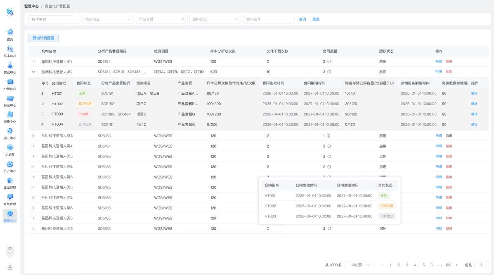
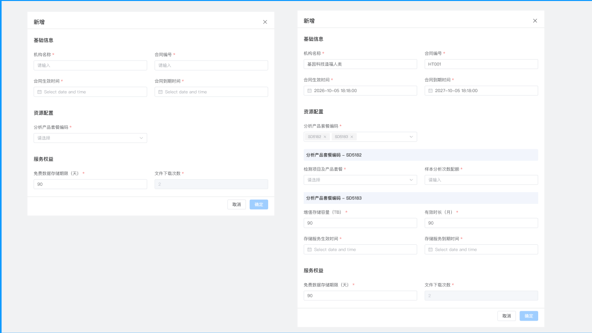
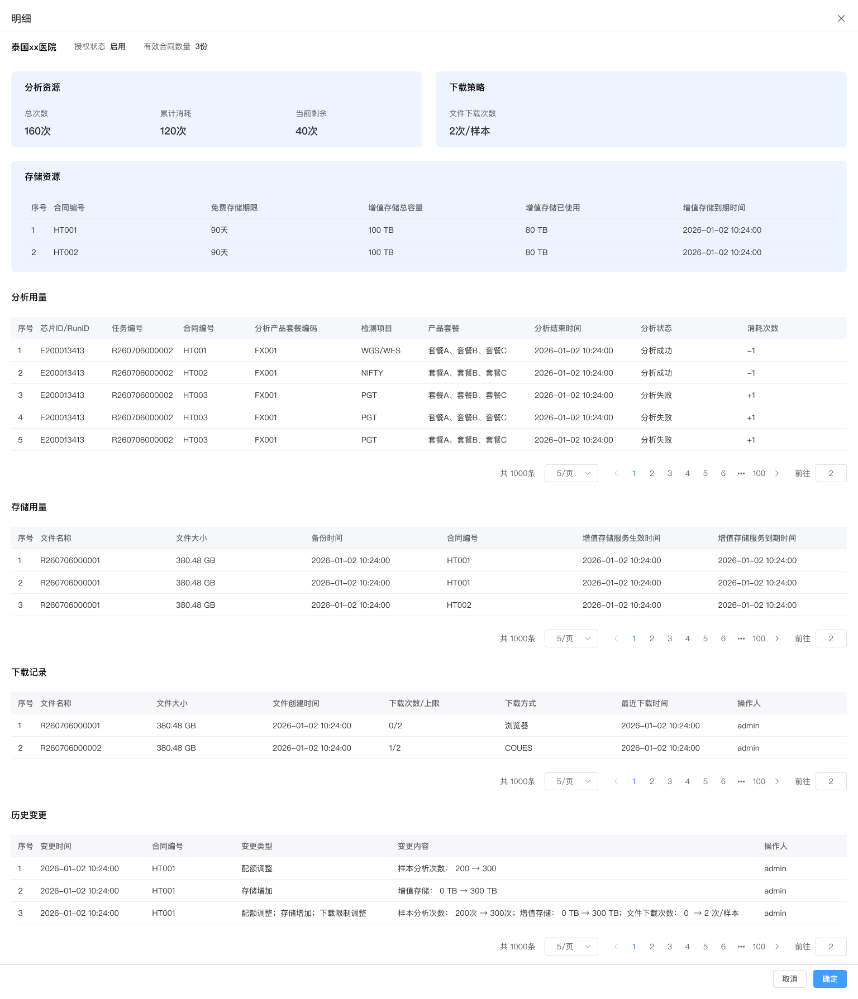

# V1.6.3 需求文档（配置中心-商业化计费配置）

> 本文档为增量需求文档，仅包含 V1.6.3 相对 V1.6.1 基线的变动 REQ。基线文档：`Prds/CONFIG-配置中心/BILLCFG-商业化计费配置/01-需求文档.md` V1.6.3 合同状态枚举变动（删除"已停用"、新增"即将生效"）影响 LIST-001 查询区"合同状态"下拉选项，LIST-001 纳入本文档变动范围。

---

## 1. 功能清单（仅变动 REQ）

| 功能点编号                      | 菜单名   | 一级页面       | 二级页面/区域       | 功能名称               | 功能描述                                                                                                                                                         | 需求类型 | 引入版本 | 最近变更版本 | 当前状态 | 优先级 | 关联验收编号 |
| ------------------------------- | -------- | -------------- | ------------------- | ---------------------- | ---------------------------------------------------------------------------------------------------------------------------------------------------------------- | -------- | -------- | ------------ | -------- | ------ | ------------ |
| `REQ-CONFIG-BILLCFG-LIST-001`   | 配置中心 | 商业化计费配置 | 查询区 / 列表页     | 列表查询与默认加载     | 按机构、检测项目、产品套餐、合同状态、合同编号查询合同配置记录，并支持默认加载与空态展示；本期合同状态枚举变动（删除"已停用"、新增"即将生效"）影响查询区下拉选项 | 修改     | V1.6.1   | V1.6.3       | 已确认   | P0     | [A01]        |
| `REQ-CONFIG-BILLCFG-LIST-002`   | 配置中心 | 商业化计费配置 | 主列表 / 展开明细区 | 合同列表展示与展开明细 | 以租户（机构）为维度展示主记录（一行一租户，多合同聚合），并支持展开查看合同维度的明细数据                                                                       | 修改     | V1.6.1   | V1.6.3       | 已确认   | P0     | [A02]        |
| `REQ-CONFIG-BILLCFG-FORM-001`   | 配置中心 | 商业化计费配置 | 新增弹窗            | 新增合同配置           | 录入机构、合同、资源配置及服务权益，创建一条新的合同配置记录，并校验合同编号唯一、存储服务周期不交叉                                                             | 修改     | V1.6.1   | V1.6.3       | 已确认   | P0     | [A04]        |
| `REQ-CONFIG-BILLCFG-FORM-002`   | 配置中心 | 商业化计费配置 | 编辑弹窗            | 编辑合同配置           | 在未产生分析消耗时允许修改合同配置，在已产生分析消耗时退化为只读查看态；编辑时同样校验不可重复配置                                                               | 修改     | V1.6.1   | V1.6.3       | 已确认   | P0     | [A05]        |
| `REQ-CONFIG-BILLCFG-DETAIL-001` | 配置中心 | 商业化计费配置 | 明细抽屉            | 明细抽屉查看           | 以右侧抽屉展示租户整体汇总 + 所有合同独立明细（分析用量、存储用量、下载记录、历史变更）                                                                          | 修改     | V1.6.1   | V1.6.3       | 已确认   | P0     | [A06]        |
| `REQ-CONFIG-BILLCFG-LIST-003`   | 配置中心 | 商业化计费配置 | 操作列 / 状态列     | 合同状态展示与启停控制 | 基线功能：合同维度状态展示与启停控制                                                                                                                             | 删除     | V1.6.1   | V1.6.3       | 已废弃   | -      | -            |

---

## 2. 模块详细需求

### 2.1 模块：配置中心 / 商业化计费配置

#### REQ-CONFIG-BILLCFG-LIST-001 列表查询与默认加载

| 字段         | 内容                          |
| ------------ | ----------------------------- |
| 功能点编号   | `REQ-CONFIG-BILLCFG-LIST-001` |
| 需求类型     | 修改                          |
| 引入版本     | `V1.6.1`                      |
| 最近变更版本 | `V1.6.3`                      |
| 当前状态     | 已确认                        |
| 关联验收编号 | `[A01]`                       |

##### 变动说明

本期仅变动查询区"合同状态"下拉选项的枚举值，其余字段、交互逻辑、异常场景均沿用 V1.6.1 基线。

##### 页面展示说明

查询区字段沿用基线，其中"合同状态"下拉选项枚举变动：

| 字段     | 控件/形式 | 约束/说明                                                                                            |
| -------- | --------- | ---------------------------------------------------------------------------------------------------- |
| 机构名称 | 下拉多选  | 支持按机构名称筛选（沿用基线）                                                                       |
| 检测项目 | 下拉多选  | 支持按检测项目筛选（沿用基线）                                                                       |
| 产品套餐 | 下拉多选  | 支持按产品套餐筛选（沿用基线）                                                                       |
| 合同状态 | 下拉单选  | 支持按合同状态筛选；枚举值变动：正常、即将到期、已到期、**即将生效**（删除"已停用"、新增"即将生效"） |
| 合同编号 | 输入框    | 支持按合同编号模糊查询（沿用基线）                                                                   |

##### 业务规则

- 查询区"合同状态"下拉选项枚举与子表格合同状态枚举保持一致：正常、即将到期、已到期、即将生效。
- 删除"已停用"枚举：禁用机构授权后，子表格中各合同的合同状态保持原值不变（不统一变为"已停用"），仅冻结该机构下所有合同的样本提交与配额消耗能力；查询区不再提供"已停用"筛选项。
- 新增"即将生效"枚举：录入系统后尚未到合同开始时间的合同，可在查询区按"即将生效"筛选。

---

#### REQ-CONFIG-BILLCFG-LIST-002 合同列表展示与展开明细

| 字段         | 内容                          |
| ------------ | ----------------------------- |
| 功能点编号   | `REQ-CONFIG-BILLCFG-LIST-002` |
| 需求类型     | 修改                          |
| 引入版本     | `V1.6.1`                      |
| 最近变更版本 | `V1.6.3`                      |
| 当前状态     | 已确认                        |
| 关联验收编号 | `[A02]`                       |

##### 功能说明

页面主列表中的一行记录代表"某机构（租户）的合同聚合记录"，用于展示机构维度的汇总信息；展开区用于展示当前机构下各合同的明细数据。底层按合同隔离数据，前端展示为聚合汇总，后端计费、配额校验、资源消耗、超限拦截仍严格遵循单合同独立管控、互不占用、互不叠加。

##### 页面展示说明

> 

主列表字段（一行一租户，多合同聚合）：

| 字段             | 说明                                                                                          |
| ---------------- | --------------------------------------------------------------------------------------------- |
| 机构名称         | 租户/机构名称                                                                                 |
| 分析产品套餐编码 | 该租户绑定的分析产品套餐编码                                                                  |
| 检测项目         | 所有合同检测项目并集去重显示                                                                  |
| 样本分析总次数   | 该租户下样本分析总配额                                                                        |
| 文件下载次数     | 单样本下载次数上限                                                                            |
| 合同数量         | 鼠标移入 HOVER 展示所有合同编号、合同生效时间、合同到期时间、合同状态，按合同到期时间倒序排列 |
| 授权状态         | 枚举值：启用、禁用                                                                            |
| 操作             | 明细、启用/禁用（冻结该机构下所有合同的样本提交与配额消耗能力）                               |

主表格操作列：

| 操作      | 说明                                                                                                                                                                                                                                                     |
| --------- | -------------------------------------------------------------------------------------------------------------------------------------------------------------------------------------------------------------------------------------------------------- |
| 明细      | 打开明细抽屉，展示该租户所有合同配额汇总                                                                                                                                                                                                                 |
| 启用/禁用 | 按钮显示与机构授权状态相反——机构授权状态为"启用"时按钮显示"禁用"，点击禁用后确认成功，按钮切换为"启用"，机构授权状态变更为"禁用"，主列表刷新展示最新授权状态；点击启用后确认成功，按钮切换为"禁用"，机构授权状态变更为"启用"，主列表刷新展示最新授权状态 |

展开明细区字段（合同展开行）：

| 字段                          | 说明                                                           |
| ----------------------------- | -------------------------------------------------------------- |
| 合同编号                      | 当前合同唯一编号                                               |
| 合同状态                      | 汇总展示所有合同状态（枚举：正常、即将到期、已到期、即将生效） |
| 分析产品套餐编码              | 当前合同绑定的分析产品套餐编码                                 |
| 检测项目                      | 当前合同绑定的检测项目                                         |
| 产品套餐                      | 当前合同绑定的产品套餐                                         |
| 样本分析次数累计消耗/总次数   | 累计消耗与总配额                                               |
| 合同生效时间                  | 合同生效时间，精确到时分秒                                     |
| 合同到期时间                  | 合同到期时间，精确到时分秒                                     |
| 增值存储已用容量/总容量（TB） | 增值存储已用容量与总容量                                       |
| 存储服务到期时间              | 存储服务到期时间，精确到时分秒                                 |
| 免费存储期限（天）            | 免费数据留存期限                                               |
| 操作                          | 编辑                                                           |

子表格操作列：

| 操作 | 说明                                  |
| ---- | ------------------------------------- |
| 编辑 | 打开编辑弹窗，弹窗标题为"编辑-合同号" |

##### 业务规则

- 主表"合同数量"字段：鼠标移入 HOVER 展示该租户下所有合同的编号、合同生效时间（精确到时分秒）、合同到期时间（精确到时分秒）、合同状态，按合同到期时间倒序排列；HOVER 弹窗最多展示前 7 条，超出加滚动条。
- 主表"分析产品套餐编码"= 展开子表中所有合同的分析产品套餐编码的去重合集。
- 主表"检测项目"= 展开子表中所有合同的检测项目的去重合集。
- 主表"样本分析总次数"= 展开子表中所有合同的样本分析次数配额之和。
- 主表"文件下载次数"= 展开子表中所有合同的文件下载次数展示口径。
- 展开明细区仅展示当前主记录所属机构下的合同数据，不跨机构混合。
- 子表格"合同状态"字段枚举与判定逻辑（由 REQ-CONFIG-BILLCFG-LIST-003 废弃后迁移保留，详见 LIST-003 废弃说明中的"合同状态枚举与判定逻辑"表）：

  | 状态     | 颜色 | 判定逻辑                                 | 含义                                   |
  | -------- | ---- | ---------------------------------------- | -------------------------------------- |
  | 正常     | 绿色 | 剩余到期时间大于 30 天                   | 合同处于有效期内且距到期日超过 30 天   |
  | 即将到期 | 橙色 | 剩余到期时间小于等于 30 天               | 合同处于有效期内但距到期日不超过 30 天 |
  | 已到期   | 红色 | 已过到期日                               | 合同已超过到期时间                     |
  | 即将生效 | 灰色 | 合同生效时间在未来（尚未到合同开始时间） | 录入系统后尚未到合同开始时间           |

  > 注：V1.6.3 删除"已停用"枚举——禁用机构授权后，子表格中各合同的合同状态保持原值不变（不统一变为"已停用"），仅冻结该机构下所有合同的样本提交与配额消耗能力。

- 存量合同存储扩容、存储续费：统一通过新增合同的形式调整存储容量、存储周期，新增合同后独立生成存储变更流水，不改动样本合同历史数据。
- 新签合同增值服务录入：通过【新增计费方案】弹窗一次性完成样本合同 + 存储服务配置。
- 所有存储变更、合同变更均独立留痕，可溯源、可对账。

##### 交互逻辑

- 每条主记录支持展开/收起。
- 页面初始状态下，所有主记录默认收起。
- 点击展开按钮后，仅展示当前机构对应的合同明细数据；再次点击可收起。
- 主表"合同数量"字段统计该租户下所有合同（不分状态），有机构即有合同，不存在为 0 的情况。

##### 异常场景 / 边界说明

- 主表以机构汇总信息为主，合同级数据以下方展开明细区为准。
- 过期、停用、终止的合同不纳入主表汇总字段计算，但可在子表格中筛选查看历史记录。
- 禁用机构授权后，子表格中各合同的合同状态保持不变，仅冻结该机构下所有合同的样本提交与配额消耗能力。
- 合同状态枚举：正常（绿色）、即将到期（橙色）、已到期（红色）、即将生效（灰色，录入系统后尚未到合同开始时间）。
- 本期不包含独立的合同级批量维护入口。

---

#### REQ-CONFIG-BILLCFG-LIST-003 合同状态展示与启停控制

| 字段         | 内容                          |
| ------------ | ----------------------------- |
| 功能点编号   | `REQ-CONFIG-BILLCFG-LIST-003` |
| 需求类型     | 删除                          |
| 引入版本     | `V1.6.1`                      |
| 最近变更版本 | `V1.6.3`                      |
| 当前状态     | 已废弃                        |
| 关联验收编号 | -                             |

##### 废弃说明

V1.6.3 主表改为"一行一租户"聚合视图，合同维度的状态展示与启停控制不再作为独立功能点，整体迁移至 REQ-CONFIG-BILLCFG-LIST-002：

- **合同状态展示**：移入子表格"合同状态"列，枚举与判定逻辑详见 LIST-002 业务规则。
- **启停控制**：从合同维度升级为机构授权维度，归入 LIST-002 主表操作列。

---

#### REQ-CONFIG-BILLCFG-FORM-001 新增合同配置

| 字段         | 内容                          |
| ------------ | ----------------------------- |
| 功能点编号   | `REQ-CONFIG-BILLCFG-FORM-001` |
| 需求类型     | 修改                          |
| 引入版本     | `V1.6.1`                      |
| 最近变更版本 | `V1.6.3`                      |
| 当前状态     | 已确认                        |
| 关联验收编号 | `[A04]`                       |

##### 功能说明

新增弹窗用于在当前页面内新增一条机构合同配置记录，完成机构基础信息、资源配置及服务权益的录入。所有合同、增值存储配置合并为【新增计费方案】一个弹窗。

##### 页面展示说明

> 

弹窗结构分为三部分：

- 基础信息
- 资源配置
- 服务权益

**显隐规则**：

- **基础信息**：默认显示。
- **资源配置**：默认显示"分析产品套餐编码"下拉多选框；根据勾选结果动态展示下方表单字段。
- **服务权益**：默认不显示；仅当"分析产品套餐编码"选择了**非 SD5193** 套餐时才显示；未选择任何套餐或仅选择 SD5193 时，不显示该模块。

底部操作区包含：取消、确定。

**基础信息字段**：

| 字段         | 控件/形式  | 必填 | 约束/说明                                                                                                                             |
| ------------ | ---------- | ---- | ------------------------------------------------------------------------------------------------------------------------------------- |
| 机构名称     | 下拉选择器 | 是   | 必填下拉选项                                                                                                                          |
| 合同编号     | 输入框     | 是   | 必填文本框，仅支持字母、数字、-、\_，最大长度 50 个字符，全局唯一不可重复                                                             |
| 合同生效时间 | 日期插件   | 是   | 必填，精确到时分秒；分析产品套餐编码勾选了"非 SD5193"时默认空、可编辑；分析产品套餐编码只勾选 SD5193 时取存储服务生效时间，且不可编辑 |
| 合同到期时间 | 日期插件   | 是   | 必填，精确到时分秒；分析产品套餐编码勾选了"非 SD5193"时默认空、可编辑；分析产品套餐编码只勾选 SD5193 时取存储服务到期时间，且不可编辑 |

**资源配置字段**：

| 字段             | 控件/形式 | 必填 | 约束/说明                                                                                                                                              |
| ---------------- | --------- | ---- | ------------------------------------------------------------------------------------------------------------------------------------------------------ |
| 分析产品套餐编码 | 下拉多选  | 是   | 必填下拉选项，可多选；根据勾选动态展示下方表单字段，一个套餐编码对应一个独立表单，可同时勾选多个（如 SD5193 和 SD51XX 同时勾选，分别显示对应表单模块） |

根据勾选的套餐编码，动态展示以下模块：

**模块：分析产品套餐-SD5193**（勾选存储产品 SD5193 时显示）：

| 字段               | 必填 | 约束/说明                                                        |
| ------------------ | ---- | ---------------------------------------------------------------- |
| 增值存储容量（TB） | 是   | 正整数，按 1TB/月为最小计费单位                                  |
| 有效时长（月）     | 是   | 正整数                                                           |
| 存储服务生效时间   | 是   | 日期插件，精确到时分秒                                           |
| 存储服务到期时间   | 是   | 日期插件，精确到时分秒，根据有效时长（月）自动代入数值，不可编辑 |

**模块：分析产品套餐-SD51XX**（勾选其他产品套餐时显示，显示逻辑：分析产品套餐编码勾选了"非 SD5193"即显示此模块）：

| 字段               | 控件/形式  | 必填 | 约束/说明                          |
| ------------------ | ---------- | ---- | ---------------------------------- |
| 检测项目及产品套餐 | 下拉选择器 | 是   | 必填下拉选项，关联分析产品套餐编码 |
| 样本分析次数配额   | 输入框     | 是   | 必填，正整数                       |

**服务权益字段**：

| 字段                   | 控件/形式      | 必填 | 约束/说明                     |
| ---------------------- | -------------- | ---- | ----------------------------- |
| 数据免费留存期限（天） | 输入框         | 是   | 默认值 90，仅支持整数，可编辑 |
| 文件下载次数           | 输入框（只读） | 是   | 默认 2，不可编辑              |

##### 业务规则

- **基础校验**：机构名称非空、合同编号全局唯一、生效时间 ≤ 到期时间、总配额为正整数、空值拦截提交、时间逻辑非法拦截。
  - **校验提示文案统一规则**：输入框/文本框 →"请输入"，下拉框/日期 →"请选择"，正整数字段 →"仅支持整数"；生效时间 ≤ 到期时间 →"合同生效时间必须小于合同到期时间"。
- **存储服务校验**：存储生效时间 ≤ 存储到期时间、所有字段非空、容量 + 周期双参数完整录入、存储参数与样本合同参数独立校验互不影响。
- **存储服务周期交叉校验**：同一机构同一时间段内不允许存在多个存储服务周期交叉的合同。若已存在增值存储合同且新合同周期重叠，提示"当前机构已有有效存储服务，新的存储服务周期与现有服务周期存在重叠，请调整服务时间"。到期后续购扩容直接生成新的存储服务周期。
- **分析产品套餐校验**：校验当前租户下是否已存在相同的分析产品套餐，存在则提示"当前机构已存在相同的分析产品套餐，请确认"。
- **存储服务购买 / 扩容**：最小计费单位 1TB/月，支持机构按合同进行存储资源续费及扩容，扩容通过新增存储服务合同方式完成。

##### 交互逻辑

- 点击"取消"后关闭弹窗，不保存当前录入内容。
- 点击"确定"后，执行表单校验；校验通过后提交新增配置，提交成功后关闭弹窗并提示"新增成功"，主列表刷新展示最新数据（新增的合同出现在列表中）；校验失败时终止提交并保持弹窗内容。

##### 异常场景 / 边界说明

- 新增弹窗为页面内弹窗交互，不跳转至新页面。
- 文件下载次数在本期为固定默认值展示，不支持用户修改。

---

#### REQ-CONFIG-BILLCFG-FORM-002 编辑合同配置

| 字段         | 内容                          |
| ------------ | ----------------------------- |
| 功能点编号   | `REQ-CONFIG-BILLCFG-FORM-002` |
| 需求类型     | 修改                          |
| 引入版本     | `V1.6.1`                      |
| 最近变更版本 | `V1.6.3`                      |
| 当前状态     | 已确认                        |
| 关联验收编号 | `[A05]`                       |

##### 功能说明

编辑弹窗用于查看并维护已存在的合同配置记录。弹窗标题为"编辑-合同号"，字段布局、分组方式与新增弹窗一致。

##### 页面展示说明

- 弹窗标题为"编辑-合同号"。
- 字段布局、分组方式（基础信息 + 资源配置 + 服务权益）、底部按钮位置与新增弹窗一致。

##### 业务规则

**可编辑性规则**：

- 检测项目**只有 SD5193**：按合同状态为"即将生效"或"增值存储已用容量"为 0 判断可编辑；其它情况不可编辑。
- 检测项目**非只有 SD5193**（即包含任意非 SD5193 套餐）：按是否有分析次数消耗判断——产生消耗后所有字段不可编辑，未产生消耗全部可编辑。

未产生分析消耗且进行产品套餐调整时，校验规则与新增弹窗一致。

保存后，在该机构的明细抽屉 - 历史变更表格新增数据。

##### 交互逻辑

- 点击"取消"后关闭编辑弹窗。
- 在"未产生分析消耗"时，点击"确定"执行字段校验，校验通过后提交；提交成功后，关闭弹窗并提示"保存成功"，主列表和子表格刷新展示最新数据；校验失败时终止提交并保持弹窗内容。
- 在"已产生分析消耗"时，所有字段置灰不可编辑，底部"确定"按钮置灰不可点击，仅允许查看当前配置内容。
- 用户从列表点击"编辑"后，总是进入编辑弹窗；是否可修改由消耗状态决定。

##### 异常场景 / 边界说明

- 已产生分析消耗时，编辑弹窗退化为只读查看态，但必须保留当前配置展示。
- 编辑弹窗仍为页面内弹窗，不跳转至新页面。

---

#### REQ-CONFIG-BILLCFG-DETAIL-001 明细抽屉查看

| 字段         | 内容                            |
| ------------ | ------------------------------- |
| 功能点编号   | `REQ-CONFIG-BILLCFG-DETAIL-001` |
| 需求类型     | 修改                            |
| 引入版本     | `V1.6.1`                        |
| 最近变更版本 | `V1.6.3`                        |
| 当前状态     | 已确认                          |
| 关联验收编号 | `[A06]`                         |

##### 功能说明

点击列表操作列中的"明细"后，系统以右侧抽屉方式展示该租户所有合同配额汇总，包括全量汇总、分析用量、存储用量、下载记录、历史变更等数据。前端展示为聚合汇总，后端计费、配额校验、资源消耗、超限拦截仍严格遵循单合同独立管控、互不占用、互不叠加。

##### 页面展示说明

> 

页面顶部展示租户整体汇总（默认置顶），下方列表展示所有合同独立明细。

**1. 全量汇总（置顶）**：

顶部汇总区采用**分块展示布局**，由**顶部概览信息行 + 分析资源、下载策略、存储资源三个区块**组成，共 4 部分；各区块以卡片形式独立展示。**统计口径**：除"有效合同数量"字段只统计有效状态（正常、即将到期）合同外，明细抽屉其他所有数据（分析用量、存储用量、下载记录、历史变更及各汇总字段）均统计该租户下**全部合同**（不分状态），过期、即将生效的合同也纳入展示，可在明细列表中查看历史记录。存储资源区块作为独立区块展示，含序号、合同编号等明细字段。

**顶部概览信息行**：

| 字段         | 说明                                                 |
| ------------ | ---------------------------------------------------- |
| 机构名称     | 租户/机构名称                                        |
| 授权状态     | 启用 / 禁用                                          |
| 有效合同数量 | N 个，只统计有效状态（正常、即将到期）合同的相关数据 |

**分析资源区块**：

| 字段     | 说明                                 | 展示示例 |
| -------- | ------------------------------------ | -------- |
| 总次数   | 该租户所有合同的分析资源总次数之和   | 160 次   |
| 累计消耗 | 该租户所有合同的分析资源累计消耗之和 | 120 次   |
| 当前剩余 | 总次数 - 累计消耗                    | 40 次    |

**下载策略区块**：

| 字段         | 说明                                   | 展示示例  |
| ------------ | -------------------------------------- | --------- |
| 文件下载次数 | 单样本下载次数上限，默认值 2，不可修改 | 2 次/样本 |

**存储资源区块**：

| 字段             | 说明                               | 展示示例            |
| ---------------- | ---------------------------------- | ------------------- |
| 序号             | 存储资源明细行序号                 | 1                   |
| 合同编号         | 当前存储所属合同编号               | HT001               |
| 免费存储期限     | 该租户所有合同的免费数据留存期限   | 90 天               |
| 增值存储总容量   | 该租户所有合同的增值存储总容量之和 | 150 TB              |
| 增值存储已使用   | 已消耗的存储容量                   | 80 TB               |
| 存储服务生效时间 | 取最早的存储服务生效时间，精确到秒 | 2025-01-01 10:24:00 |
| 增值存储到期时间 | 取最晚的存储服务到期时间，精确到秒 | 2026-01-01 10:24:00 |

**2. 分析用量**：

以消耗时间由近到远排序，逐条展示租户下所有合同独立数据。

| 字段             | 说明                                                   |
| ---------------- | ------------------------------------------------------ |
| 序号             | 当前明细行序号                                         |
| 芯片 ID / RUN ID | 测序任务对应的芯片 ID / RUN ID                         |
| 任务编号         | 测序任务编号                                           |
| 合同编号         | 当前消耗所属合同编号                                   |
| 分析产品套餐编码 | 当前消耗所属合同绑定的分析产品套餐编码                 |
| 检测项目         | 当前消耗对应的检测项目                                 |
| 产品套餐         | 当前消耗对应的产品套餐                                 |
| 分析结束时间     | 精确到秒                                               |
| 分析状态         | 分析成功 / 分析失败                                    |
| 消耗次数         | 分析资源中的累计消耗次数；分析成功为正数，分析失败为负 |

**3. 存储用量**：

以消耗时间由近到远排序，购买了增值存储服务的租户才展示该模块。

显示条件：只要机构下存在增值存储合同，点开明细即显示该模块。

| 字段             | 说明                                                  |
| ---------------- | ----------------------------------------------------- |
| 序号             | 当前明细行序号                                        |
| 文件名称         | 备份文件名称                                          |
| 文件大小         | 文件字节数（`fileSizeBytes`），前端按值动态显示 GB/TB |
| 备份时间         | 备份发生时间                                          |
| 合同编号         | 当前存储所属合同编号                                  |
| 存储服务到期时间 | 精确到秒                                              |

**4. 下载记录**：

以消耗时间由近到远排序，汇总展示租户下所有合同、所有用户、所有单测序文件的全量下载记录。

| 字段          | 说明                                                  |
| ------------- | ----------------------------------------------------- |
| 序号          | 当前下载记录序号                                      |
| 文件名称      | 下载文件名称                                          |
| 文件大小      | 文件字节数（`fileSizeBytes`），前端按值动态显示 GB/TB |
| 文件创建时间  | 文件创建时间                                          |
| 下载次数/上限 | 当前样本累计下载次数与上限                            |
| 下载方式      | 枚举值：浏览器 / COEUS                                |
| 最近下载时间  | 最近一次下载时间                                      |
| 操作人        | 执行下载的操作人                                      |

**5. 历史变更**：

以消耗时间由近到远排序，聚合展示租户下所有合同的全量变更记录，集中汇总样本配额调整、合同续约、存储新购/扩容/续费、参数编辑、状态变更等所有操作。

| 字段     | 说明                                           |
| -------- | ---------------------------------------------- |
| 序号     | 当前变更记录序号                               |
| 变更时间 | 本次变更发生时间                               |
| 合同编号 | 当前变更所属合同编号                           |
| 变更类型 | 配额调整、存储增加、下载限制调整等，可能多个值 |
| 变更内容 | 字段名称：原始值 → 变更值，多个字段用分号隔开  |
| 操作人   | 执行本次变更的操作人                           |

##### 业务规则

###### 1. 汇总与计算规则

| 分类       | 指标                      | 规则                                                                                 |
| ---------- | ------------------------- | ------------------------------------------------------------------------------------ |
| 顶部汇总区 | 有效合同数量              | 只统计有效状态（正常、即将到期）合同的相关数据；已到期、即将生效的合同不纳入此项统计 |
| 顶部汇总区 | 分析资源-总次数           | 该租户下所有合同的样本分析次数配额之和（不分状态）                                   |
| 顶部汇总区 | 分析资源-累计消耗         | 该租户下所有合同的样本分析次数累计消耗之和（不分状态）                               |
| 顶部汇总区 | 分析资源-当前剩余         | 分析资源-总次数 - 分析资源-累计消耗                                                  |
| 顶部汇总区 | 存储资源-增值存储总容量   | 该租户下所有合同的增值存储总容量之和（不分状态）                                     |
| 顶部汇总区 | 存储资源-增值存储已使用   | 存储用量模块文件大小之和                                                             |
| 顶部汇总区 | 存储资源-存储服务生效时间 | 取最早的存储服务生效时间                                                             |
| 顶部汇总区 | 存储资源-增值存储到期时间 | 取最晚的存储服务到期时间                                                             |

###### 2. 用量明细来源与范围

| 分类     | 规则项                     | 说明                                                                                                         |
| -------- | -------------------------- | ------------------------------------------------------------------------------------------------------------ |
| 数据来源 | 分析用量来源               | 来源于当前合同配置下的测序任务记录                                                                           |
| 字段来源 | 芯片 ID / RUN ID、任务编号 | 来源于测序任务创建时产生的 ID 和编号                                                                         |
| 数据范围 | 展示范围                   | 仅展示当前租户合同配置自身关联的消耗数据，不跨租户汇总                                                       |
| 状态策略 | 过期、即将生效合同         | 纳入明细列表展示，可在明细列表中查看历史记录；仅"有效合同数量"字段不统计此类合同，其他汇总字段均统计全部合同 |

###### 3. 存储用量来源与范围

| 分类     | 规则项             | 说明                                                                                                                                                                             |
| -------- | ------------------ | -------------------------------------------------------------------------------------------------------------------------------------------------------------------------------- |
| 数据来源 | 存储用量来源       | 来源于当前合同配置下的备份文件记录                                                                                                                                               |
| 字段来源 | 文件名称、文件大小 | 来源于备份文件生成时的元数据；文件大小为字节数 `fileSizeBytes`                                                                                                                   |
| 数据范围 | 展示范围           | 仅展示当前租户合同配置自身关联的存储用量数据，不跨租户汇总                                                                                                                       |
| 显示条件 | 展示条件           | 购买了增值存储服务的租户才展示                                                                                                                                                   |
| 格式化   | 文件大小动态显示   | 按 `fileSizeBytes` 值大小动态选择单位：≥1TB 显示 TB（保留 2 位小数），否则显示 GB（保留 2 位小数），如 `1048576` → `0.00GB`、`1073741824` → `1.00GB`、`1099511627776` → `1.00TB` |

###### 4. 下载记录规则

| 分类     | 规则项           | 说明                                                                                               |
| -------- | ---------------- | -------------------------------------------------------------------------------------------------- |
| 数据来源 | 下载记录来源     | 来源于当前租户合同配置下所有合同、所有用户、所有单测序文件的全量下载记录                           |
| 数据范围 | 展示范围         | 汇总展示租户下所有合同的下载记录                                                                   |
| 格式化   | 文件大小动态显示 | 按 `fileSizeBytes` 值大小动态选择单位：≥1TB 显示 TB（保留 2 位小数），否则显示 GB（保留 2 位小数） |

###### 5. 历史变更记录规则

| 分类     | 规则项           | 说明                                                                                                                   |
| -------- | ---------------- | ---------------------------------------------------------------------------------------------------------------------- |
| 数据来源 | 历史变更记录来源 | 聚合展示租户下所有合同的全量变更记录，集中汇总样本配额调整、合同续约、存储新购/扩容/续费、参数编辑、状态变更等所有操作 |
| 新增场景 | 首条记录生成     | 新增操作成功后，应生成首条历史变更记录                                                                                 |
| 编辑场景 | 变更记录生成     | 编辑操作成功后，应生成新的历史变更记录，用于体现本次编辑前后的字段变化                                                 |
| 数据范围 | 展示范围         | 仅展示当前租户合同配置自身产生的变更数据，不跨租户汇总                                                                 |

##### 交互逻辑

- 点击"明细"后，从页面右侧打开抽屉。
- 明细抽屉为只读查看场景。
- 顶部汇总区在页面顶部常驻置顶，下方为各明细模块。
- 明细抽屉底部仅保留"关闭"按钮，按钮文案为"关闭"。

##### 异常场景 / 边界说明

- 明细抽屉不支持在当前视图内直接编辑配置。
- 顶部汇总区、各明细模块均仅展示当前租户合同对应的数据，不跨租户混合展示。
- 过期、即将生效的合同均纳入明细抽屉展示，可在明细列表中查看历史记录；仅"有效合同数量"字段不统计此类合同。

---

## 3. 变动说明

| REQ 编号                        | 变动类型 | 变动摘要                                                                                                                                                                                                                                                                                                                                                                                                                               |
| ------------------------------- | -------- | -------------------------------------------------------------------------------------------------------------------------------------------------------------------------------------------------------------------------------------------------------------------------------------------------------------------------------------------------------------------------------------------------------------------------------------- |
| `REQ-CONFIG-BILLCFG-LIST-001`   | 修改     | 查询区"合同状态"下拉选项枚举变动：删除"已停用"、新增"即将生效"（与子表格合同状态枚举保持一致）；其余查询字段、交互逻辑、异常场景沿用基线                                                                                                                                                                                                                                                                                               |
| `REQ-CONFIG-BILLCFG-LIST-002`   | 修改     | 主表格从"一行一合同"改为"一行一租户，多合同聚合"；主表字段重新设计（8 个字段：机构名称/分析产品套餐编码/检测项目/样本分析总次数/文件下载次数/合同数量 HOVER/授权状态/操作）；子表格字段重新设计（12 个字段：合同编号/合同状态/分析产品套餐编码/检测项目/产品套餐/样本分析次数累计消耗总次数/合同生效时间/合同到期时间/增值存储已用容量总容量/存储服务到期时间/免费存储期限/操作）；操作列改为"明细/启用禁用"（主表）+ "编辑"（子表格） |
| `REQ-CONFIG-BILLCFG-LIST-003`   | 删除     | 合同维度状态展示与启停控制不再作为独立功能点；合同状态移入子表格；启停控制从合同维度升级为机构授权维度（统一归入 LIST-002 操作列）                                                                                                                                                                                                                                                                                                     |
| `REQ-CONFIG-BILLCFG-FORM-001`   | 修改     | 弹窗结构从"基础信息+付费信息"改为"基础信息+资源配置+服务权益"；资源配置分区改造为"分析产品套餐编码"下拉多选+动态模块（SD5193 存储模块、SD51XX 分析模块）；新增存储服务购买/扩容规则、服务周期交叉校验、合同编号唯一校验                                                                                                                                                                                                                |
| `REQ-CONFIG-BILLCFG-FORM-002`   | 修改     | 弹窗标题改为"编辑-合同号"；可编辑性规则改为"检测项目 SD5193 按合同状态/已用容量判断，非 SD5193 按消耗状态判断"；保存后历史变更表格新增数据                                                                                                                                                                                                                                                                                             |
| `REQ-CONFIG-BILLCFG-DETAIL-001` | 修改     | 保留抽屉形式，扩展为聚合汇总展示；汇总区调整为**分块展示布局**（分析资源/下载策略/存储资源三个区块）；新增存储用量模块（条件展示）、下载记录模块；分析用量字段保留基线字段并新增合同编号列；有效合同状态为正常、即将到期                                                                                                                                                                                                               |

---

## 4. 非功能要求（变动部分）

- **双系统兼容**：页面能力、规则与展示口径需同时适配 HALOS、OmicsOne 双系统租户场景。
- **国际化**：到期预警、容量预警、下载超限等提示均需中英文双语支持，满足海外备案要求。
- **审计约束**：付费配置、存储变更、下载操作、数据清理、租户状态变更全量日志永久留痕，可查询、可追溯、可对账。
- **可用性**：新增、编辑、明细均在当前页面链路内完成，避免跳转造成上下文丢失。

---

## 5. 验收标准（仅变动 REQ）

| 验收编号 | 对应功能点                      | 验收描述                                                                                                                                                                                                                                                                                                                                                                                                                                                                                                                                                                                                                                                                                                                                                                                                                                                                                                                                                                                                                                                                                                                                                                                                                                                                     | 优先级 |
| -------- | ------------------------------- | ---------------------------------------------------------------------------------------------------------------------------------------------------------------------------------------------------------------------------------------------------------------------------------------------------------------------------------------------------------------------------------------------------------------------------------------------------------------------------------------------------------------------------------------------------------------------------------------------------------------------------------------------------------------------------------------------------------------------------------------------------------------------------------------------------------------------------------------------------------------------------------------------------------------------------------------------------------------------------------------------------------------------------------------------------------------------------------------------------------------------------------------------------------------------------------------------------------------------------------------------------------------------------- | ------ |
| A01      | `REQ-CONFIG-BILLCFG-LIST-001`   | Given 列表页查询区存在"合同状态"下拉筛选项，When 用户点击"合同状态"下拉框，Then 下拉选项展示 4 个枚举值：正常、即将到期、已到期、即将生效（不含"已停用"）；选择"即将生效"并点击查询，列表返回合同生效时间在未来的合同记录；选择其他状态按对应判定逻辑筛选；其余查询字段（机构名称、检测项目、产品套餐、合同编号）及交互逻辑（默认加载、查询、重置、新增入口）沿用基线                                                                                                                                                                                                                                                                                                                                                                                                                                                                                                                                                                                                                                                                                                                                                                                                                                                                                                        | P0     |
| A02      | `REQ-CONFIG-BILLCFG-LIST-002`   | Given 列表存在机构合同配置记录，When 用户查看主列表并展开某条机构记录，Then 主表以"一行一租户"展示机构维度聚合信息（机构名称、分析产品套餐编码、检测项目并集去重、样本分析总次数、文件下载次数、合同数量、授权状态、操作），主表操作列仅含"明细、启用/禁用"（无编辑入口）；展开区以子表格展示该租户下所有合同维度的独立明细（合同编号、合同状态带颜色标签、分析产品套餐编码、检测项目、产品套餐、样本分析次数累计消耗/总次数、合同生效时间、合同到期时间、增值存储已用容量/总容量、存储服务到期时间、免费存储期限、操作），子表格操作列含"编辑"入口；"合同数量"字段鼠标移入展示悬浮卡片（所有合同编号、生效时间、到期时间、合同状态，按到期时间倒序，最多前 7 条，超出加滚动条）；底层计费与配额校验仍按单合同独立管控（主表"合同数量"统计该租户下所有合同，有机构即有合同，不存在为 0 的情况，详见 §2.2.1）                                                                                                                                                                                                                                                                                                                                                                                                                                                                 | P0     |
| A04      | `REQ-CONFIG-BILLCFG-FORM-001`   | Given 用户打开新增计费方案弹窗，When 填写基础信息（机构名称、合同编号、合同生效/到期时间）、资源配置（分析产品套餐编码多选+SD5193 存储配置或 SD51XX 检测项目配额）、服务权益（数据免费留存期限、文件下载次数）并通过校验，Then 系统允许提交新增配置，提交成功后关闭弹窗并提示"新增成功"，主列表刷新；合同编号全局唯一不可重复；分析产品套餐编码只勾选 SD5193 时合同生效/到期时间取存储服务生效/到期时间，勾选了"非 SD5193"时默认空可编辑；存储生效时间 ≤ 存储到期时间；存储参数与样本合同参数独立校验；当前租户已存在增值存储合同时提示"当前机构已有有效存储服务，新的存储服务周期与现有服务周期存在重叠，请调整服务时间"；当前租户已存在相同分析产品套餐时提示"当前机构已存在相同的分析产品套餐，请确认"；文件下载次数默认 2 不可编辑，数据免费留存期限默认 90 可编辑；删除已选套餐时对应分区立即消失且数据清空；修改存储服务生效时间后到期时间自动重新计算                                                                                                                                                                                                                                                                                                                                                                                                                 | P0     |
| A05      | `REQ-CONFIG-BILLCFG-FORM-002`   | Given 用户从子表格点击"编辑"，When 进入编辑弹窗（标题"编辑-合同号"），Then 字段布局与新增弹窗一致；检测项目非 SD5193 且未产生分析消耗时全部字段可编辑，产生消耗后全部字段置灰不可编辑；检测项目 SD5193 且合同状态为"即将生效"或"增值存储已用容量"为 0 时可编辑，其它情况不可编辑；可编辑态下点击"确定"通过校验后提交，提交成功后关闭弹窗并提示"保存成功"，主列表和子表格刷新展示最新数据，并在该机构明细抽屉-历史变更表新增数据；不可编辑态下"确定"按钮置灰不可点击，"取消"按钮保持可用，仅允许查看                                                                                                                                                                                                                                                                                                                                                                                                                                                                                                                                                                                                                                                                                                                                                                          | P0     |
| A06      | `REQ-CONFIG-BILLCFG-DETAIL-001` | Given 用户点击主表操作列"明细"，When 明细抽屉打开，Then 顶部汇总区采用分块展示布局，分为**分析资源、下载策略、存储资源**三个区块，以卡片形式独立展示： **顶部概览信息行**（机构名称、授权状态、有效合同数量 N 个） **分析资源区块**：总次数（160 次示例）、累计消耗（120 次示例，红色展示）、当前剩余（40 次示例） **下载策略区块**：文件下载次数（2 次/样本，默认值不可修改） **存储资源区块**：序号（1）、合同编号（HT001）、免费存储期限（90 天示例）、增值存储总容量（150 TB 示例）、增值存储已使用（80 TB 示例）、增值存储到期时间（精确到秒，取最晚的存储服务到期时间） 汇总数据仅统计有效状态合同（正常、即将到期）；分析用量表（序号、芯片 ID/RUN ID、任务编号、合同编号、分析产品套餐编码、检测项目、产品套餐、分析结束时间精确到秒、分析状态、消耗次数成功为正失败为负）按消耗时间由近到远排序；存储用量表（仅购买增值存储的租户展示）按消耗时间由近到远排序；下载记录表（合同编号、样本编号、文件名称、文件大小、文件创建时间、下载次数/上限、下载方式枚举浏览器/COEUS、最近下载时间、操作人）汇总所有合同所有用户所有单测序文件全量下载记录；历史变更表（序号、变更时间、合同编号、变更类型可能多值、变更内容字段:原始值 → 新值、操作人）聚合所有合同全量变更记录；四表均支持分页；明细列表可通过条件筛选查看单合同明细；抽屉底部仅保留"关闭"按钮 | P0     |
