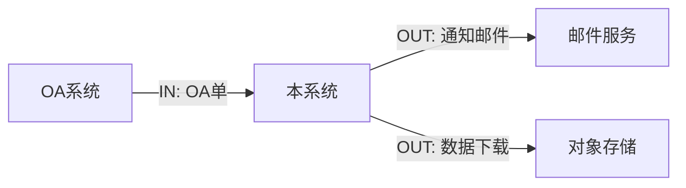

# 数据流转设计模板

## 0. 使用说明

- **上游输入**：`docs/01-需求文档.md`（角色、功能清单、业务字段、业务状态、外部系统依赖）。
- **下游消费者**：原型文档、详细设计文档、前端文档、测试用例文档。
- **产出原则**：以「数据」为主语描述系统行为；只回答「数据从哪来、到哪去、谁能看到、出错怎么办」，不写页面布局，不写完整接口签名。
- **命名约定**：输出到 `docs/01b-数据流转设计.md`；实体名使用大驼峰英文（如 `OaOrder`），属性使用 camelCase（如 `oaNo`）。

---

## 1. 外部系统关系

> **填写指引**：用一张系统上下文图（Mermaid 或文字版）说明本系统与外部系统的交互边界；逐个外部系统给出数据方向、协议、字段范围、频率、SLA 假设。
>
> **字段清单**：
>
> | 字段名 | 类型 | 必填 | 说明 | 示例值 |
> |---|---|---|---|---|
> | 系统编码 | string | 是 | 唯一英文代号 | OA |
> | 系统名 | string | 是 | 中文 | OA系统 |
> | 方向 | enum(IN/OUT/BIDI) | 是 | 数据流向 | IN |
> | 协议 | enum(REST/MQ/SFTP/EMAIL/SOAP) | 是 | - | REST |
> | 频率 | string | 是 | 实时/T+1/每小时 | 实时 |
> | 字段范围 | string | 是 | 摘要 | OA单号、申请人、产品编码 |
>
> **示例片段**（摘自 `framework/examples/OmicsDB-V1.0.0/01-需求文档.md`）：
>
> > 数据已交付后，会发送邮件通知客户可下载数据。
>
> **常见错误**：
>
> - 把内部模块画进上下文图（破坏边界）。
> - 缺方向标注，下游无法判断谁是被动方。

### 1.1 系统上下文

### 1.2 外部系统清单

| 系统编码 | 系统名 | 方向 | 协议 | 频率 | 字段范围 |
|---|---|---|---|---|---|
| OA | OA系统 | IN | REST | 实时 | {字段} |

---

## 2. 核心数据实体

> **填写指引**：列出全部业务实体（不是数据库表）；每个实体写「业务含义 + 关键属性 + 标识符 + 生命周期」；属性命名必须与详设、接口字段一致。
>
> **字段清单**：
>
> | 字段名 | 类型 | 必填 | 说明 | 示例值 |
> |---|---|---|---|---|
> | 实体编码 | string(PascalCase) | 是 | 英文实体名 | OaOrder |
> | 实体名 | string | 是 | 中文 | OA申请单 |
> | 业务标识符 | string | 是 | 唯一键属性 | oaNo |
> | 关键属性 | object[] | 是 | 属性表 | 见下 |
> | 生命周期 | string | 是 | 创建→消亡 | 提交→审核→关闭 |
>
> **示例片段**：
>
> > 销售提交oa申请单…依据定时器生成的不同任务单，交付数据。
>
> **常见错误**：
>
> - 把数据库表当作实体，引入 `id`/`gmt_create` 等技术字段污染业务建模。
> - 同一业务概念在不同模块出现两个名字（OaOrder 与 OrderApply）。

### 2.1 实体 OaOrder（OA申请单）

| 属性 | 类型 | 必填 | 业务含义 | 示例 |
|---|---|---|---|---|
| oaNo | string | 是 | 唯一标识 | OA20260101001 |
| applicant | string | 是 | 申请人 | 张三 |
| applyTime | datetime | 是 | 申请时间 | 2026-05-18T10:00:00+08:00 |
| status | enum | 是 | 见 5.1 | PENDING |

### 2.2 实体 {EntityName}

{重复}

---

## 3. 实体关系

> **填写指引**：用 ER 图或关系表说明实体之间的基数（1:1 / 1:N / N:N）和外键归属；展开关键依赖路径。
>
> **字段清单**：
>
> | 字段名 | 类型 | 必填 | 说明 | 示例值 |
> |---|---|---|---|---|
> | 主实体 | string | 是 | PascalCase | OaOrder |
> | 关联实体 | string | 是 | - | Task |
> | 关系 | enum(1:1/1:N/N:N) | 是 | - | 1:N |
> | 外键属性 | string | 是 | 持有外键的一方 | Task.oaNo |
> | 级联策略 | string | 是 | 删除/归档 | 软删除 |
>
> **示例片段**：
>
> > 销售仅需提交一个申请单，存在一个申请单对应多个任务单场景。
>
> **常见错误**：
>
> - 基数标注模糊（写「关联」不写 1:N）。
> - 双向关联但没说明外键归属，详设无法落库。

| 主实体 | 关联实体 | 关系 | 外键 | 级联策略 |
|---|---|---|---|---|
| OaOrder | Task | 1:N | Task.oaNo | 软删除 |

---

## 4. 主流程数据流

> **填写指引**：对每条主业务流程画出数据流（DFD）：起点、终点、每一步操作的「读 / 写 / 校验 / 派发」，标注涉及的实体与状态变更。
>
> **字段清单**：
>
> | 字段名 | 类型 | 必填 | 说明 | 示例值 |
> |---|---|---|---|---|
> | 步骤号 | string | 是 | S01.. | S01 |
> | 触发 | string | 是 | 角色/定时器/外部事件 | SALES |
> | 操作 | enum(READ/WRITE/EMIT/CALL) | 是 | - | WRITE |
> | 涉及实体 | string[] | 是 | - | [OaOrder] |
> | 状态变更 | string | 否 | from→to | NEW→PENDING |
> | 派发事件 | string | 否 | 事件名 | OaOrderSubmitted |
>
> **示例片段**：
>
> > 销售提交oa申请单 → 依据定时器生成任务单 → 交付角色处理任务单 → 邮件通知客户。
>
> **常见错误**：
>
> - 流程只写"提交申请单"，不写写入哪个实体、状态如何变化。
> - 缺定时器/事件触发节点，下游测试用例覆盖不到。

### 4.1 主流程 F01：OA单申请到交付

| 步骤号 | 触发 | 操作 | 涉及实体 | 状态变更 | 派发事件 |
|---|---|---|---|---|---|
| S01 | SALES | WRITE | OaOrder | -→PENDING | OaOrderSubmitted |
| S02 | SCHEDULER | WRITE | Task | -→PENDING | TaskCreated |
| S03 | DELIVERY | WRITE | Task | PENDING→DONE | TaskCompleted |
| S04 | SYSTEM | CALL | - | - | NotifyEmail |

---

## 5. 状态流转

> **填写指引**：对每个具备状态机的实体，给出全部状态、转移条件、触发者、并发约束；状态编码必须与需求文档一致。
>
> **字段清单**：
>
> | 字段名 | 类型 | 必填 | 说明 | 示例值 |
> |---|---|---|---|---|
> | 实体 | string | 是 | PascalCase | Task |
> | from | string | 是 | 起始状态 | PENDING |
> | to | string | 是 | 目标状态 | DOING |
> | 触发条件 | string | 是 | 业务条件 | 交付领取任务 |
> | 触发者 | string | 是 | 角色/系统 | DELIVERY |
> | 并发约束 | string | 否 | 同一时刻只允许一个… | 单任务单单进行人 |
>
> **示例片段**：
>
> > 主要交付角色来处理查看任务单。
>
> **常见错误**：
>
> - 状态编码与需求里出现差异（中文展示与编码不一致也算）。
> - 无终止状态或无逆向转移规则。

### 5.1 状态机：Task

| from | to | 触发条件 | 触发者 |
|---|---|---|---|
| - | PENDING | 定时器创建 | SCHEDULER |
| PENDING | DOING | 领取任务 | DELIVERY |
| DOING | DONE | 提交交付物 | DELIVERY |
| DOING | FAILED | 标记异常 | DELIVERY |

---

## 6. 权限过滤规则

> **填写指引**：定义数据读写时的权限过滤策略；按「角色 × 实体 × 操作」组织；显式声明跨角色越权场景如何被拦截。
>
> **字段清单**：
>
> | 字段名 | 类型 | 必填 | 说明 | 示例值 |
> |---|---|---|---|---|
> | 角色 | string | 是 | 角色编码 | CUSTOMER |
> | 实体 | string | 是 | - | OaOrder |
> | 操作 | enum(READ/WRITE) | 是 | - | READ |
> | 过滤条件 | string | 是 | SQL/伪代码 | orgCode = currentUser.orgCode |
> | 越权处理 | string | 是 | - | 返回 403 + 审计日志 |
>
> **示例片段**：
>
> > 客户：查看和下载数据；需求：查看并下载数据，只能访问本机构数据。
>
> **常见错误**：
>
> - 权限过滤只写在前端列表里，缺失后端过滤条件。
> - 越权后没有审计落地。

| 角色 | 实体 | 操作 | 过滤条件 | 越权处理 |
|---|---|---|---|---|
| CUSTOMER | OaOrder | READ | orgCode = currentUser.orgCode | 403+审计 |

---

## 7. 异常流和补偿策略

> **填写指引**：枚举所有异常分支：上游失败、超时、重复提交、外部系统不可用、数据不一致；每条给出检测点、补偿策略、人工介入入口。
>
> **字段清单**：
>
> | 字段名 | 类型 | 必填 | 说明 | 示例值 |
> |---|---|---|---|---|
> | 异常编号 | string | 是 | E01… | E01 |
> | 触发场景 | string | 是 | - | OA回写超时 |
> | 检测方式 | string | 是 | - | 5分钟未确认 |
> | 自动补偿 | string | 是 | 重试/降级/回滚 | 指数退避重试3次 |
> | 人工入口 | string | 是 | 后台菜单/工单 | 后台「OA单补单」 |
>
> **示例片段**：
>
> > 存在未下机状态的样本编码数据，待下机后，交付用户。
>
> **常见错误**：
>
> - 只写「需要重试」，没说重试次数和退避。
> - 缺人工入口，长尾异常无收敛。

| 异常编号 | 触发场景 | 检测方式 | 自动补偿 | 人工入口 |
|---|---|---|---|---|
| E01 | {场景} | {检测} | {补偿} | {入口} |

---

## 8. 数据一致性要求

> **填写指引**：声明跨实体、跨服务、跨系统的一致性级别（强/最终/读修复）；列出关键事务边界与幂等键。
>
> **字段清单**：
>
> | 字段名 | 类型 | 必填 | 说明 | 示例值 |
> |---|---|---|---|---|
> | 场景 | string | 是 | - | OA单与任务单创建 |
> | 一致性级别 | enum(强/最终/读修复) | 是 | - | 最终 |
> | 事务边界 | string | 是 | 同一事务/分布式 | 同库事务 |
> | 幂等键 | string | 是 | 防重复键 | oaNo |
> | 收敛时间 | string | 是 | SLA | ≤ 60s |
>
> **示例片段**：
>
> > 存在周期性交付场景，固定每一周或每两周交付数据。
>
> **常见错误**：
>
> - 写「保证一致性」不指明级别。
> - 缺幂等键，重复回调污染数据。

| 场景 | 一致性级别 | 事务边界 | 幂等键 | 收敛时间 |
|---|---|---|---|---|
| {场景} | 最终 | {边界} | {键} | {SLA} |

---

## 附录 A. 与下游文档的字段映射

| 数据流转（实体属性） | 详细设计（JSON 字段） | 数据库（snake_case） | 接口响应字段 | 前端表格列 | 测试断言字段 |
|---|---|---|---|---|---|
| OaOrder.oaNo | oaNo | oa_no | oaNo | oaNo | oaNo |
| Task.taskNo | taskNo | task_no | taskNo | taskNo | taskNo |
| Task.status | status | status | status | statusText（展示）/status（数据） | status |
| OaOrder.applyTime | applyTime | apply_time | applyTime | applyTime | applyTime |
| Customer.orgCode | orgCode | org_code | orgCode | orgCode | orgCode |
| OaOrderSubmitted（事件） | event=OA_SUBMITTED | mq topic: oa.submitted | - | - | event=OA_SUBMITTED |
| User.roleCode | roleCode | role_code | roleCode | roleCode | roleCode |

---

## 附录 B. 一致性检查清单

- [ ] 0 节「使用说明」四项均填写。
- [ ] 系统上下文图覆盖了需求文档「外部系统依赖」的全部系统。
- [ ] 每个核心实体均给出业务标识符与生命周期。
- [ ] 实体之间的关系基数明确为 1:1 / 1:N / N:N，并标注外键归属。
- [ ] 每条主业务流程都展开为带状态变更与事件派发的步骤表。
- [ ] 每个具备状态的实体均给出完整状态机（含终止状态）。
- [ ] 每条权限规则都包含后端过滤条件，不只依赖前端隐藏。
- [ ] 所有异常分支都给出检测方式 + 自动补偿 + 人工入口。
- [ ] 跨系统/跨实体场景显式声明一致性级别与幂等键。
- [ ] 实体与属性命名与需求字段映射一致（附录 A）。
- [ ] 文档未出现页面布局细节、未出现完整接口签名。
