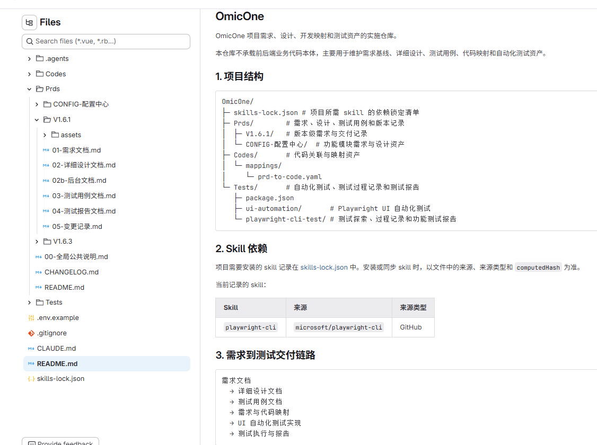

# AI 赋能：需求开发到自动化测试

> 分享时长：约 30 分钟
> 面向听众：技术团队同事
> 侧重点：自动化测试 60% / 需求开发测试协同方案 40%

---

## 一、开场：我们为什么要做这件事（约 2 分钟）

### 1.1 从背景出发

1. **目标**：为了提升、保证开发质量，我们想要做自动化测试。
2. **但自动化测试是系统开发的最后一环**：如果只是通过测试用例写出来的脚本，测试的覆盖度和准确度完全不够。
3. **原因**：脚本缺少对需求的完整理解，需要上游文档作为知识库支撑——需求文档、详细设计文档等。
4. **由此引出核心问题**：如何让"需求 → 开发 → 测试"围绕同一条主线跑起来，并用 AI 把自动化测试的产出效率提上去。

### 1.2 今天讲什么

- 协同方案：需求基线保覆盖度、结构化详设保准确度、AI 与技能全流程提效
- Playwright：执行层怎么做，失败怎么归因
- 实战：一个真实模块从需求到自动化脚本的完整落地

---

## 二、协同方案：从需求输入到封版的全链路（约 11 分钟）

### 2.1 流程主线

```text
产品原始输出（原始需求文档 / 原型图）
   ↓ （整理 + 澄清 + 结构化）
需求基线（01-需求文档.md + REQ 编号 + 验收条件）
   ↓
详细设计（02-详细设计文档.md）
   ↓
开发实现（代码 + prd-to-code 映射）
   ↓
测试设计 + 自动化（03-测试用例文档.md + ATS-*.spec.ts）
   ↓
执行回归
   ├─ 发现缺陷 → 缺陷单挂 REQ → 开发修复（PR 挂同一 REQ）→ 回归验证
   └─ 通过 → 结果回填（04-测试报告文档.md）
   ↓
封版（CHANGELOG.md + Git Tag）
```

### 2.2 需求侧：为什么需要"需求基线化"？（决定测试覆盖度）

产品其实已经有输出，但产品**原始输出的形态**难以被 AI 和团队直接消费：

1. **文档格式不同、风格不同**：不同产品经理产出的需求描述差异大，AI 解析时容易遗漏关键约束
2. **文档零散、查找完整功能逻辑难**：产品需求文档往往只给出增量的需求点，而开发/AI 需要该功能点的**完整描述**，得翻多个版本文档拼凑，**增加 AI 理解难度**，也增加团队成员查找成本
3. **逻辑藏在原型图里**：部分逻辑只体现在原型图/页面截图中，AI 要读取图片并理解业务规则**本身就容易出问题**
4. **缺少交互逻辑**：需求往往只描述功能点，缺少交互细节（状态流转、联动规则、边界行为），**直接影响测试用例的覆盖度**——用例从需求派生，需求没写到的交互，测试就覆盖不到
5. **追溯困难**：测试脚本、缺陷、代码变更与需求点之间缺少关联，出问题时说不清"这个脚本测的是哪个需求、这个缺陷影响哪个功能点"，变更影响范围只能靠人判断

**对应解决方式**：

1. **首次基线化**：把产品原始输出收敛为结构化、模板统一的 `01-需求文档.md`，并为每个功能点打上 `REQ` 编号
2. **版本增量回写基线**：版本关闭时（`version-archive`）把本版增量按 REQ 合并回模块基线全量文档，保证功能点的**完整描述始终一处可查**，开发/AI 无需翻多个版本文档拼凑

### 2.3 详设侧：为什么需要结构化详设？（决定测试准确度）

需求文档管"**测没测到**"（覆盖度），详设管"**测得对不对**"（准确度）。`02-详细设计文档.md` 中每个功能点（REQ）沉淀五类关键信息，它们正是写测试脚本的**直接输入**：

| 详设内容 | 对测试脚本的作用 |
|---|---|
| 前端路由 | 决定测试入口 |
| 接口信息 | 决定请求与响应断言 |
| 字段名称 | 决定数据与文案校验 |
| 交互逻辑处理 | 决定操作步骤 |
| data-testid 清单（详设 §7） | 决定元素定位 |

反过来说：没有结构化详设，路由、接口、字段、testid 这些信息在需求文档（01）和测试用例（03）里都找不到，AI 写脚本只能自己去翻前端代码和接口文档——缺 `data-testid` 就只能用脆弱的 CSS 定位，接口/字段断言只能照抄代码实现，**断言自然不准**。

> 因此原则是：**断言以文档为准，不以代码为准**——文案/业务规则对齐 01，结构/字段/定位对齐 02；前端代码只用于核对定位与实现。

### 2.4 AI 与技能：如何全流程提效？（决定效率）

**协作载体**：整个流程以 **TRAE / qOder / 其他支持 AI 的 IDE + Git 仓库** 为统一协作载体：

- 需求、开发、测试在同一工作区查看同一套公共信息，文档、代码、脚本、版本记录通过 Git 持续留痕
- 多仓模式兼容前端仓、后端仓、测试仓独立管理，系统治理仓保留统一入口
- **对 AI 而言**：统一工作区比零散聊天记录更容易形成稳定上下文，便于影响分析、脚本生成和结果回填

**AI 全流程分工**——以"给一个模块做自动化测试"为例，每个环节做什么、用什么技能、谁来做，**AI 不替代测试本身，而是嵌入每个环节提效**：

| 环节 | 做什么 | 使用的技能 | 谁来做 | 产出 |
|---|---|---|---|---|
| 1. 文档准备 | 需求基线 → 详设 → 测试用例（01/02/03） | `requirement-doc-bootstrap` / `detail-design-bootstrap` / `testcase-generation` | skill + 人确认 | 01/02/03 文档 + REQ/FT/IT |
| 2. 自动化建设 | 生成目录与脚本骨架 + 页面摸底 | `ui-automation-bootstrap` / `api-automation-bootstrap` / `playwright-cli-testing` | AI | spec/page/fixture/data 骨架 + data-testid 快照 |
| 3. 脚本实现 | 填充真实交互、断言、测试数据 | `playwright-test-implementation` | AI + **人（审核硬性）** | 可执行的 ATS-*.spec.ts |
| 4. 执行回归 | 确定性执行测试用例，自动出报告 | `playwright-test-implementation` | Playwright（确定性执行） | 测试报告 |
| 5. 失败分析与回填 | 失败归因（缺陷/脚本/环境/数据）+ 更新测试报告 | `playwright-test-implementation` | AI 建议 + 人确认 | 失败分类 + 04-测试报告文档.md |

> 讲述要点：第 3 步人工审核是硬性环节——AI 生成的骨架**必须**经人补齐审核才能成为正式脚本；第 4 步执行必须是 Playwright 确定性脚本，不让 AI 实时决策。

**贯穿全程的支撑技能**：

- 测试数据：`test-data-preparation`，测试数据准备
- 版本管理：`version-archive` / `version-release`，归档回写基线 + 封版打 Tag

**AI 的定位：副驾**：

| 能力 | 职责 |
|---|---|
| skill | 固定流程触发、目录脚手架、命名校验、回填骨架 |
| agent | 读取需求/详设/原型，整理场景、接口、断言点 |
| AI | 生成脚本初稿、补齐 schema、失败归因、修复建议 |
| 人 | 审核需求口径、确认边界、审核脚本与结果 |

> 边界：AI **可做**——解析需求、生成骨架、分析失败、生成回填建议；**不可做**——未经审核改主干脚本、无依据加断言、自主跳过失败用例。

### 2.5 协同方案的关键设计

| 设计 | 作用 |
|---|---|
| **双主线治理** | 目录路径主线（模块归属） + 功能点编号主线（具体追踪） |
| **统一模板** | 01/02/03 文档结构对齐，AI 可稳定消费 |
| **REQ 统一主键** | 贯穿需求/设计/开发/测试/缺陷/回归 |
| **结构化目录** | `Prds/` 目录 + 文件名 + 编号三位一体，**天然支持检索**，解决 Ones 不支持 RAG 问答的问题 |

实际项目的目录结构示例：



> 图示：按"模块目录 + 01/02/03 文档 + 版本目录"组织的 Prds 结构，需求资产天然结构化、可检索。

### 2.6 小结：三大支撑

| 支撑 | 解决什么 |
|---|---|
| **需求文档（01）** | 测试**覆盖度**——测试点从 REQ 全量派生，功能点不漏 |
| **详细设计（02）** | 测试**准确度**——断言的预期值、文案、定位有结构化依据 |
| **IDE + AI** | **提效**——文档生成、脚本生成、失败分析全链路 AI 辅助 |

> 三大支撑就绪，最后缺一个稳定高效的**执行引擎**——这就是接下来要讲的 Playwright。

---

## 三、Playwright 自动化测试（约 8 分钟）

### 3.1 Playwright 是什么

- 微软维护的现代浏览器自动化框架，支持 Chromium / Firefox / WebKit，多浏览器一致性较好
- 原生支持自动等待、trace、截图、录像、网络拦截、storageState 等能力
- 适合企业后台、复杂交互场景；UI 与 API 可同栈，统一治理成本低

### 3.2 两种使用方式：playwright-cli vs playwright test

**先认识这两种方式**：

- **playwright-cli（交互式）**：npx playwright 命令行执行，不写脚本。在 AI IDE 里直接驱动浏览器——你说"帮我测列表查询"，AI 实时决定打开哪个页面、点什么、填什么，边读 DOM 边判断结果对错。适合快速摸底
- **playwright test（脚本化）**：用官方完整测试框架包 `@playwright/test` 编写 `ATS-*.spec.ts` 脚本，断言（`expect`）预先写死，机器确定性执行，每次运行结果一致。适合长期回归

**两者的关系：底层引擎一致，差别在"谁做判断"**：

- 两者都是 Playwright 驱动浏览器、读取 DOM
- `playwright test`：人预写 `expect` 断言，机器确定性执行
- `playwright-cli`：AI Agent 实时决策每一步操作（判定依据仍是 DOM 文案精确比对，截图仅留证不参与判定）
- 一句话：AI 是"**驾驶员**"，不是"**眼睛**"

**真实数据对比（V1.6.1 试点，同一批用例双路线实测）**：

| 维度 | playwright-cli（探索式） | playwright test（脚本回归） |
|---|---|---|
| 模式 | AI 实时驱动，不写脚本 | 预写断言，机器执行 |
| 首次执行 | ~70 分钟（39 例，含 AI 思考决策） | 脚本编写 ~120 分钟 + 执行 4 分 42 秒（42 例） |
| Token 消耗 | ~920K / **每次回归都要重新消耗** | 一次性投入，**后续回归零 Token** |
| 覆盖度 | 89.7%（主动跳过写操作，避免污染数据） | 81.0%（含写操作，但数据污染影响后续用例） |
| 执行通过率 | 65.7% | 85.3% |
| CI/CD | 不适合（结果不可复现） | 适合（可作回归门禁） |

**优势互补，发现的问题不重合**：

- **cli 擅长抓"口径类"缺陷**：如校验提示文案与用例预期不符（真实缺陷，test 因断言宽松漏检）；还能动态适应页面数据（现有数据恰好满足条件就直接测，不像脚本硬编码 skip）
- **test 擅长跑"全链路"**：写操作用例全覆盖，能通过 route 拦截验证网络层（缓存复用等），可复现、可进 CI

**使用场景与最佳实践**：

| 场景 | 用哪个 | 对应 skill |
|---|---|---|
| 首次功能验证 / 发版前摸底 / 缺陷探查 | playwright-cli | `playwright-cli-testing` |
| 页面探索：确认 data-testid 真实存在、维护快照 | playwright-cli | `playwright-cli-testing` |
| 新模块接入：生成目录与脚本骨架 | playwright test | `ui-automation-bootstrap` |
| 长期回归 / 版本迭代门禁 / 失败修复 | playwright test | `playwright-test-implementation` |

> 最佳实践：**cli 先行探路，脚本跟进沉淀**——先用 cli 快速摸底、发现缺陷，修复后再用 `playwright-test-implementation` 固化为可回归脚本。

### 3.3 目录结构示意（关键）

```text
Tests/
├─ shared/              # 登录态、鉴权、公共能力
└─ ui-automation/
   ├─ playwright.config.ts
   ├─ fixtures/         # 登录态、前后置
   ├─ helpers/
   ├─ <一级模块>/<二级模块>/
   │  ├─ specs/         # ATS-*.spec.ts
   │  ├─ pages/         # 页面对象
   │  ├─ fixtures/
   │  ├─ data/          # 测试数据
   │  └─ snapshots/
   └─ test-reports/     # 报告出口
```

### 3.4 UI 脚本分层

| 层 | 作用 |
|---|---|
| `specs/` | 场景脚本，面向需求点/测试点 |
| `pages/` | 页面对象封装 |
| `fixtures/` | 登录态、前后置、数据装配 |
| `data/` | 输入参数与断言数据集中管理 |

### 3.5 UI 定位规范

定位优先级：`getByTestId` → `getByRole + name` → 稳定属性 → 脆弱 CSS

> 前端配合要求：关键元素增加稳定标识（`data-testid`），权限显隐有明确可观察行为。

### 3.6 失败归因：六分类

| 分类 | 说明 |
|---|---|
| `ENV` | 环境不可用、服务/网络异常 |
| `AUTH` | token、权限、登录态问题 |
| `DATA` | 测试数据、前置数据不成立 |
| `SCRIPT` | 脚本本身问题 |
| `DEFECT` | 产品/前后端真实缺陷 |
| `CHANGE` | 需求/页面/接口变更，脚本未同步 |

---

## 四、实战案例：BILLCFG-商业化计费配置（约 7 分钟）

### 4.1 案例概览

| 项 | 数据 |
|---|---|
| 模块 | BILLCFG-商业化计费配置（CONFIG-配置中心） |
| 试点版本 | V1.6.1（0→1） / V1.6.3（1→1.x） |
| REQ 数量 | V1.6.1：6 个（全部 P0）/ V1.6.3：5 个变动 + 1 个废弃 |
| 测试用例 | 48 → 54 条（持续补充） |
| 自动化 spec | 6 个（LIST/FORM/DETAIL） |

### 4.2 场景一：V1.6.1（0 → 1，从零开始）

**怎么跑通的**：

| 时间 | 动作 | 使用的 skill |
|---|---|---|
| 7.6-7.7 | 需求讨论确认 + 整理需求 + 生成 01 文档 + 6 个 REQ | `requirement-doc-bootstrap` |
| 7.8–7.10 | 开发实现 + 更新 prd-to-code 映射 | （编码） |
| 7.13 | 生成 02 详设 + 03 用例 | `detail-design-bootstrap` + `testcase-generation` |
| 7.13–7.14 | 用 `playwright-cli` 跑第一种方式（交互式 + 截图） | `playwright-cli-testing` |
| 7.13–7.14 | 用 `playwright-test-implementation` 跑第二种方式（脚本化 + JUnit） | `playwright-test-implementation` |

> V1.6.1 试点正是 3.2 节"两种使用方式"对比的数据来源：同一批用例，cli 探索式跑了 39 例（发现文案类缺陷），test 脚本回归跑了 42 例（覆盖写操作全链路），双路线互补。

**投入时间与产出**：

- 从需求评审到跑通回归，**整个闭环约 7 个工作日**
- 6 个 spec 文件，48 条用例一次性落地
- 关键发现：详设阶段允许"**code→design 反推**"（先有前端代码，再反推 02 详设），原因是 skill 硬约束要求"前端代码 + 后台 spec"才能生成 02

**维护成本**：

- 6 个 spec 脚本在迭代中**增量改动**即可，未大改
- 失效概念/场景在 V1.6.1 阶段无需考虑（首次生成）

**测试效果**：

- 通过率：达到首次基线门禁
- 已发现并记录需求、详设、用例之间的多处不一致（后续版本修复）

### 4.3 场景二：V1.6.3（1 → 1.x，增量迭代）

**怎么跑通的**：

| 时间 | 动作 | 使用的 skill |
|---|---|---|
| 8.17–8.19 | 增量需求整理：变动检测 + 5 个 REQ 续号 + 1 个废弃 | `requirement-doc-bootstrap`（增量模式） |
| 8.19 | 详设 + 用例 + 一致性检查 + skill 优化 | `detail-design-bootstrap` + `testcase-generation` + 手工修正 |
| 8.20 | 开发联调 | （编码） |
| 8.24 | 完成 6 个 spec，共 54 条用例 | `playwright-test-implementation` |
| 8.25 | 全量回归 3 轮 | `run-report.mjs` + AI 报告 |

**投入与产出**：

- 整个增量闭环约 **5 个工作日**（含 skill 优化）
- 优化/新增 9 个 skill 规则（4 类越界拦截 + 2 条详设规则 + 1 条需求检测维度）

**测试效果（8.25 第 3 轮全量回归，54 条用例）**：

| 指标 | 数值 |
|---|---|
| 通过率 | 80.0%（40/50），达 80% 门禁 |
| 有效 bug | 4 项（DEFECT：文案、查询、缓存、编辑保存） |
| 误报 | 3 项（断言策略：颜色、toast 范围、文案逐列） |
| 漏测 | 2 项（写操作未断言刷新、需求文档错误） |
| 跳过 | 4 项（存储合同、分页、启停场景，均为测试数据不足） |
| 错误 | 2 项（SCRIPT：定位回归、子表行不足） |

### 4.4 投入产出与维护成本（两个场景总结）

**时间投入拆解（两个版本实测）**：

| 项 | V1.6.1（0→1） | V1.6.3（1→1.x） |
|---|---|---|
| 版本周期 | ~7 个工作日 | ~5 个工作日 |
| 实际编码 | 3 天（占比 ~43%） | 1 天（占比 ~20%） |
| 测试脚本编写 | ~1 天（占比 ~15%） | ~1 天（占比 ~20%） |
| 其余时间 | 需求/详设/用例生成 + 首轮双路线验证 | 增量需求整理 + 一致性检查 + 3 轮回归 |

> 关键观察：编码之外的时间（需求整理、详设、用例、脚本、回归）占了周期的一半以上——这些正是**知识库建设与消费**的时间。

**核心权衡：知识库颗粒度 vs 人力投入**：

- 测试的准确度和覆盖度，**基本靠知识库（01/02/03 文档）投喂**——知识库颗粒度越详细，生成的用例和脚本越准确
- 但知识库越细，**整理的投入时间越多、人的确认与审核时间也越多**，这些时间会直接挤占开发时间
- 本质是一道权衡题：**知识库质量 ↔ 交付速度**，需要按模块重要性（P0/P1）选择投入程度

**维护成本（需求变动 + 增量场景）**：

- **需求变动**：01/02/03 与测试脚本需联动更新，变动越大维护成本越高
- **增量场景成本更高**：要先判断**失效的知识库**（如"配额行"概念已删除）、评估**影响范围**（哪些用例、哪些脚本受牵连），再决定增/改/删——这个判断本身就费人力

**下一个挑战：多模块联动（尚未试点验证）**：

当前试点是**单模块闭环**（BILLCFG 模块内）。后续推广到多模块、且模块之间存在数据联动时，复杂度会明显上升：

1. **知识库需要扩展**：单模块的 01/02/03 不够用——跨模块的数据流转需要专门的数据流转设计（如 `01b-数据流转设计.md`，影响状态/权限/数据流转时启用）
2. **测试场景膨胀**：除各模块自身场景外，还要覆盖跨模块业务流程（如 A 模块的配置变更 → B 模块的状态/展示变化）
3. **影响范围评估更复杂**：一个模块的需求变动，可能波及其他模块的知识库与脚本，失效判断从"模块内"扩展到"跨模块"

> 应对思路：编号体系已预留跨模块扩展（`REQ-{模块}-...` 各模块独立编号、跨域异常用例 `ET-{MODULE}-X-{NNN}`）；但数据流转知识库的颗粒度、跨模块场景的组织方式，还需要在多模块试点中进一步验证。


---

## 五、总结（约 2 分钟）

### 5.1 回到开场的问题

> 怎么让"需求 → 开发 → 测试"围绕同一条主线跑起来，并用 AI 把自动化测试的产出效率提上去？
>
> **用一个 REQ 编号贯穿全流程**：需求文档保覆盖度，详设保准确度，IDE + AI 提效，Playwright 确定性执行——两个版本试点已验证，沉淀出一套可复制、可审计的自动化测试体系。
>
> **但它不是免费的**：知识库的整理与审核会挤占开发时间，需求变动、增量迭代、多模块联动都会带来持续的维护成本——需要按模块重要性（P0/P1）权衡投入程度。

### 5.2 关键 Takeaway

1. **一个编号**：REQ 贯穿需求、代码、用例、脚本、缺陷、结果，全链路可追踪、可回填
2. **三大支撑**：需求文档（01）保覆盖度、详细设计（02）保准确度、IDE + AI 提效
3. **两条路线**：cli 探路（AI 驾驶员，快速摸底抓缺陷）+ 脚本沉淀（确定性回归、零 Token、可进 CI）
4. **一个定位**：AI 是副驾——产出必须经人审核，执行必须确定性
5. **一道权衡**：知识库质量 ↔ 交付速度，按模块 P0/P1 决定投入程度

---

## 附：时间分配参考

| 章节 | 时长 |
|---|---|
| 开场：为什么做这件事 | 2 min |
| 协同方案：从需求输入到封版的全链路（含 AI 与技能协同） | 11 min |
| Playwright 自动化测试（含两种使用方式对比） | 8 min |
| 实战案例：BILLCFG（0→1 与 1→1.x 两个场景） | 7 min |
| 总结 | 2 min |
| **合计** | **约 30 min** |
